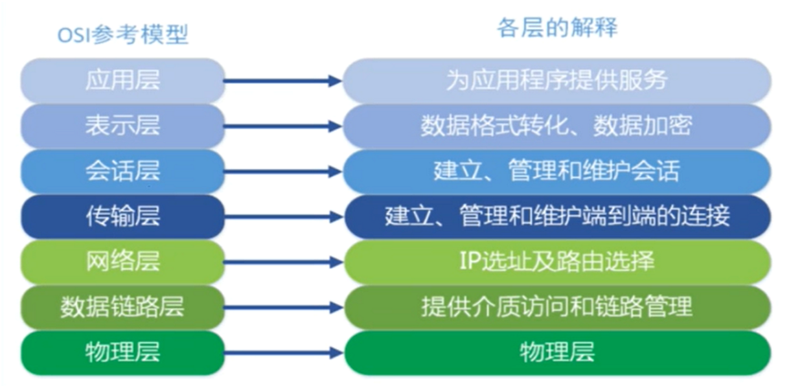
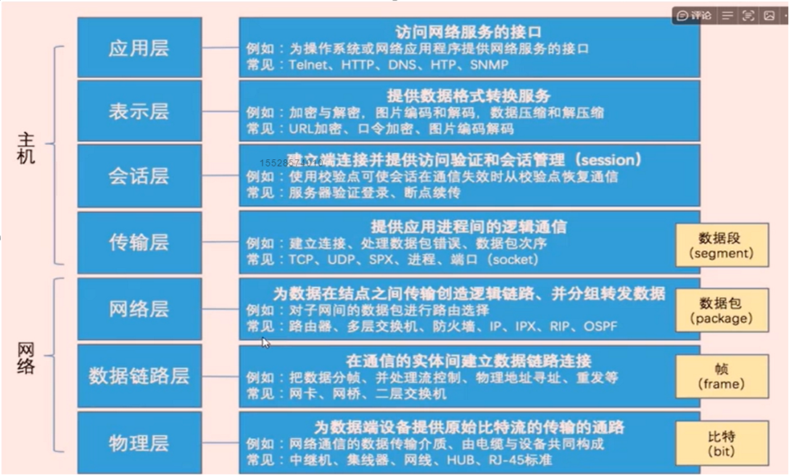
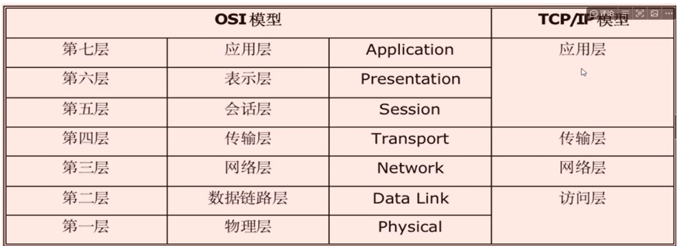
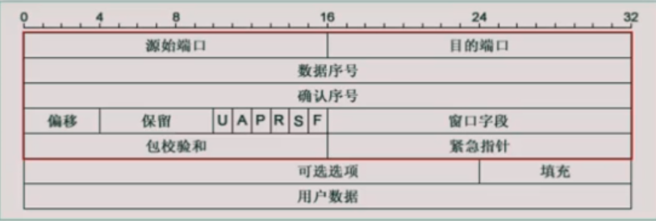
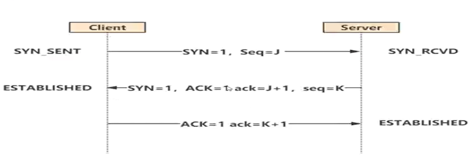
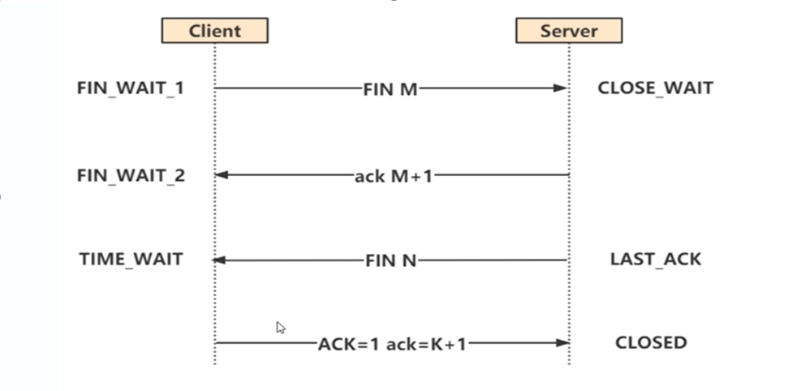
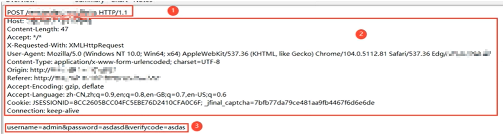
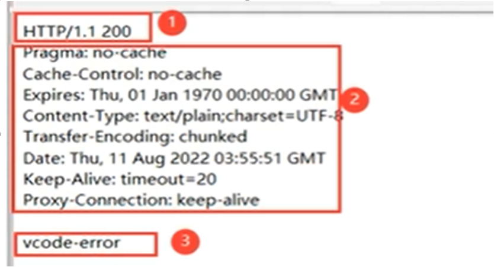
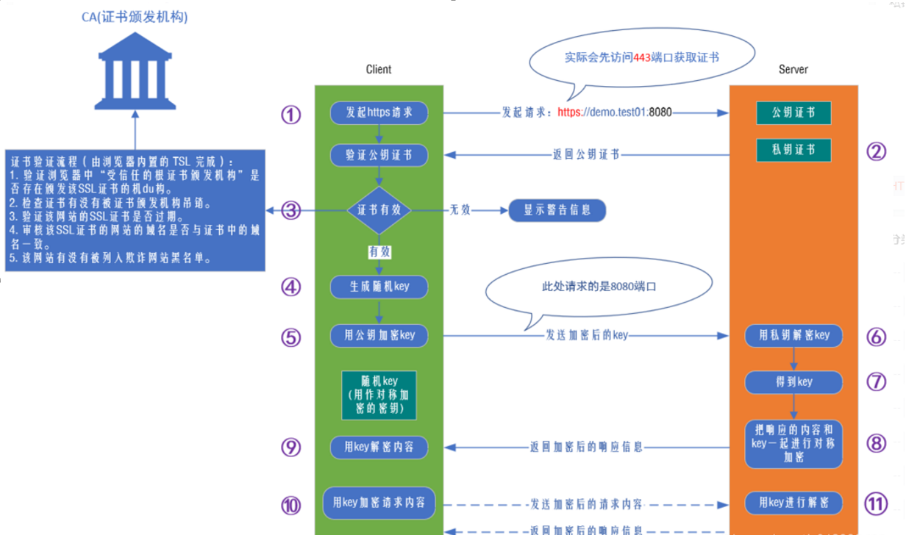

# python基础

## 1. python虚拟环境
### 1.1. 虚拟环境的作用
- 隔离每个项目所需要的不同的依赖，避免由于不同的项目需要不同的依赖库版本而造成的冲突情况。
### 1.2. 创建虚拟环境
#### 1.2.1. 命令行创建
- **主流的虚拟环境管理包**：`virtualenv`和`pipenv`
  - 安装`virtualenv`：`pip install virtualenv`
  - 创建虚拟环境：`virtualenv [-p 解释器路径] 路径`
    - `-p`可选的，指定python解释器版本
  - 切换为虚拟环境：
    - 进入虚拟环境路径中的`Script`中，运行`activate.bat`
    - 退出虚拟环境：运行`deactivate.bat`
- **virtualenvwrapper**：virtualenv虚拟环境管理工具的一个辅助包。
  - 安装：`pip install virtualenvwrapper`
    - `wornon`命令不能用时，安装`pip install virtualenvwrapper-win`
  - 作用：简化virtualenv的操作，可以在任意路径操作虚拟环境。
  - 主要命令：
    - `workon`:显示当前已配置的虚拟环境列表
      - 需要配置环境变量：新建变量`WORKON_HOME`,值为虚拟环境路径。
    - `workon 虚拟环境名`:进入指定的虚拟环境。
      - powershell进入失败时，换cmd
    - `mkvirtualenv [-p 解释器路径] 虚拟环境名`：创建虚拟环境。`-p` 可选的,创建指定Python版本的虚拟环境
#### 1.2.2. pycharm创建
- 新建项目时，选择Virtualenv新建环境。

## 2. python和python的一些区别
- **print**
  - python2中是一个语句
  - python3中是一个函数(可以接收参数)；
- **字符编码**
  - python2中默认编码格式ASCII，不支持中文，需要在开头通过`#coding:utf8`才行；
  - python3默认为`utf8`。不需要再开头指定；
- **input**
  - python2中会根据输入的数据类型返回相应数据类型的值，输入数字返回数字，输入字符串必须加双引号，否则会以变量的形式返回。
  - python3中输入数据全部以字符串返回。
- **除法**
  - python2同c语言一样，两个整数的运算结果只能是整数，存在结果有小数部分直接丢弃。如`1/2=0`,要得到正确的值需要用浮点数计算`1.0/2=0.5`;
  - python3中整数除法保留小数部分。

## 3. 标识符、变量和对象
### 3.1. 标识符

-   **什么是标识符？**
    -   对变量名、函数名、类名、方法名的统称
-   **命令规范**
    -   只能包含字母、数字、下划线（用中文在任何位置也不会报错，但一般不用中文）
    -   不能以数字开头
    -   严格区分大小写
    -   不能与系统关键字相同
        -   在python中导入：`import keyword`
        -   输入：`keyword.kwlist` 即可看到系统关键字
    -   尽量不与系统的内置函数、模块名相同
    -   尽量使用有意义的英文单词，多个单词之间使用下划线连接
### 3.2. 变量的声明

-   如：**`student_name = "zhangsan"`**
    -   后续可以直接重新赋值` student_name = 1000`
-   如：**a,b = 10,20** （表示声明两个变量a,b，值分别为10，20）
    -   **a,b = b,a** （表示将a,b两个变量的值进行了交换，a = 20 b = 10）
-   如：**c = 10,20,30** （会将三个值打包为元组（tuple）类型赋给c变量））
-   当我们赋值时，如`a = "hello"` ，python解释器做了两件事：
    -   在内存中创建了一个`"hello"`的字符串对象；
    -   在内存中创建了一个名为`a`的变量，并把它指向`"hello"` 。
-   **声明变量时会在内存里面开辟一块空间来保存变量名（栈内存），也会开辟一块空间来保存值（对象）（堆内存），并将变量指向该对象（值）。**
    -   在python中，类型属于对象，变量是没有类型的。
        -   如`a=[1,2,3]` `a="Runoob"` ，`[1,2,3]` 是 List 类型，`"Runoob"` 是 String 类型，而变量 a 是没有类型，它仅仅是一个对象的引用(一个指针)，可以是 List 类型对象，也可以指向 String 类型对象。
-   赋值的时候是把值在内存空间中的地址给到这个变量。也就是说变量里面保存的不是这个值，而是这个值在内存空间中的地址。
-   假如已有变量 a = 20，再声明变量 b = 20，此时系统会去内存里面找到已有的20这个值，并把20这个值的内存地址给到b，而不会去重新开辟一块内存地址。也就是说此时 a和b是指向同一个内存地址的(即id(a) = id(b))。此时 a is b 为True a == b 为True
### 3.3. 对象

-   **Python中的一切都是对象。变量是对对象的引用！**（对象是一个抽象，可想象成现实中的一个实际物体）
-   **对象的本质是**：对象是分配的一块内存，有足够的空间去表示它们所代表的值。或者说，一块内存空间，拥有特定的值，支持指定类型的相关操作。
-   **对象的特点**：`标识(identity)`、`类型(type)`、`值(value)`
    -   `标识(identity)`：用于唯一标识对象，通常对应对象在计算机内存中的地址。使用内置函数`id(obj)`返回对象唯一标识。
    -   `类型(type)`：对象中含有标准的头部信息，类型标识符。标识对象类型，表示对象存储的数据的类型。类型可以限制对象的取值范围和可执行的操作。使用内置函数`type(obj)`返回对象所属类型。
        -   每个对象都有两个标准的头部信息：
            1.  类型标识符，去标识对象的数据类型；
            2.  引用计数器，记录当前对象的引用的数目。（回收机制：变量的引用计数器为0，自动清理。较小整数型对象有缓存机制。）
    -   `值(value)` ：表示对象存储的数据的信息。使用内置函数`print(obj)` 可以直接打印值。
-   **`is`和`==`&#x20;**
    -   区别
        -   `is` ：判断两个变量是否指向同一个对象，比较两个引用是否代表了内存中同一个地址，是否指向同一块内存空间。通过`id(obj)` 返回值判断。
        -   `==` ：比较对象的本身内容【类型(type)】和【值(value)】是否一致。默认会调用`__eq__` 方法。
    -   关系
        -   当`id(obj)`相同是，`is`为True，两者的`type` 和`value` 肯定相同，`==` 也为True。
        -   但是当两者的`type` 和`value` 相同时，`==` 为True，两者的`id(obj)` 不一定相同。
            ```python
            >>> a = [1,2]
            >>> b = [1,2]
            >>> a == b
            True
            >>> a is b
            False
            >>>
            >>> c = 257
            >>> d = 257
            >>> c == d
            True
            >>> c is d
            False

            ```
-   **小整数 small\_ints 和 短字符串 缓存池**
    -   CPython(c语言实现的python解释器)出于性能优化的考虑，把频繁使用的整数对象用一个`small_ints`的对象池缓存起来。`small_ints` 缓存的整数值被设定为\[-5,256]这个区间。
    -   如果使用CPython解释器，在任何引用这些整数的地方，都不需要重新创建int对象，而是直接引用缓存池中的对象。
    -   **如果整数不在该范围内，那么即便两个整数的值相同，它们也是不同的对象。**
        ```python
        # 小整数
        >>> a = 256
        >>> b = 256
        >>> a is b
        True
        # 短字符串
        >>> a = 'good'
        >>> b = 'good'
        >>> a is b
        True

        >>> c = 'very good'
        >>> d = 'very good'
        >>> c is d
        False


        ```

## 4. 输入与输出
### 4.1. 注释
- **单行注释**：`#` 或`ctrl + /`
- **多行注释**：三对引号（单引号`''' '''` 或双引号`""" """` 都行）
  - 注：若这三对引号放在等号`=`右边，表示的是字符串，而不是注释
### 4.2. 输入
- **输入**：`input(msg)`
  - 用于接收外部输入，阻塞式的，程序运行到input语句时会暂停，直到按下回车键后继续执行下面的代码；
	- msg：可选的，用于对输入的提示；
	- 无论外部输入的内容是什么，input函数都作为字符串处理；
		- 如 username = input("请输入用户名：")；
		- 无论输入数字，字符串，布尔值，列表等 print(type(username)) 类型都为 str(字符串),相当于在外面加上引号。
- 查看函数或者类的源码
	- `ctrl + 鼠标点击`
### 4.3. 输出
- **输出**：`print(obj1,obj2,sep='',end='\n',file=sys.studout)`
	- 用于输出指定内容;
	- `obj1`,`obj2`：待输出的对象，多个对象之间逗号隔开;
	- `sep=''`：指定多个对象输出结果中的分割符，默认是空格，可以任意指定;
	- `end='\n'`：指定输出完成后的结束符，默认'\n'，即换行;
    - `file=sys.stdout`：将内容输出到文件。
    ```python
    username = input("请输入用户名：") #声明变量，接收外部输入
    password = input("请输入密码：")
    print("账号：",username,"密码：",password)           #输出 账号： user 密码： 123456   每个值与值之间默认有空格
    print("账号：",username,"密码：",password,sep='',end='')    #输出 账号：user密码：123465      每个值与值之间指定分割符为空;结束符为空
    print("账号：",username,"密码：",password,sep='**',end='')  #输出 账号：**user**密码：**123456      每个值与值之间指定分割符为**
    ```

## 5. 数据类型
### 5.1. 不同的数据类型的意义
- 不同的数据类型可以处理不同的问题和场景，不同的数据类型也有不同的方法。
- **可变数据类型和不可变数据类型**
  - **不可变数据类型**：当该数据类型对应的变量的值发生了改变时，它对应的内存地址也`发生改变`，这种数据类型叫做`不可变数据类型`；
  - **可变数据类型**：当该数据类型对应的变量的值发生了改变时，它对应的内存地址`不发生改变`，这种数据类型叫做`可变数据类型`。
    ```python
    # 往列表（集合，字典同理）添加了元素，但列表的内存地址不变，为可变数据类型
    >>> li = [1,2,3]
    >>> id(li)
    3074861559936
    >>> li.append(5)
    >>> id(li)
    3074861559936
    ```
### 5.2. python中的标准数据类型
- 共6种
  - **String 字符串型**：有下标(index)，有顺序，可迭代，不可变；
  - **Number 数值型**；不可变；
  - **List 列表型**：有下标，有顺序，可迭代，可变。；
  - **Tuple 元组型**：有下标，有顺序，可迭代，不可变；
  - **Dictionary 字典类型**：无序，没有下标，可迭代,可变，key是唯一且不可变的(整型、字符串、元组)；
  - **Set 集合型**：没有顺序，没有下标，不可重复，可变。
### 5.3. 字符串
#### 5.3.1. 字符串的创建

-   包含在`引号`之间的内容，不可变数据类型。
    -   使用`单引号`或`双引号`来创建字符串，使用`三引号`创建多行字符串。
    -   字符串要么使用两个单引号，要么两个双引号，不能一单一双！
    -   Python不支持单字符类型(C或者类似语言的Char类型)，单字符在Python中也是作为一个字符串使用。
-   如果一个字符串内部要有引号，那么最好和外部包裹的引号类型不同。
    -   外层使用单引号，那么里层使用双引号
    -   外层使用双引号，那么里层使用单引号
    -   如果要使用一样的符号，那字符串里的引号前记得加转义符号：`\`
        ```python
        >>> msg = 'what\'s you name'
        >>> msg
        "what's you name"
        ```
#### 5.3.2. 字符串元素的访问
- 通过索引访问到字符串中的指定的元素。
-   `字符串[索引]`
-   索引从0开始，从左往右，第一个位置的索引为0，以此类推。
-   索引可以为负数，从右往左，最后一个位置为-1，以此类推。
#### 5.3.3. 字符串格式化
- 格式化输出：把数据按照特殊格式进行输出的操作，有以下三种实现方式。
-   **占位符**
    -   语法：`'%[-w.p]type' %(value)`或`'%(var)[-w.p]type' %{"var":value}`
        -   `[-w.p]`：可选的，`-` 表示左对齐(默认为右对齐)，`w` 表示宽度（表示w个空格），`.p` 表示精度,保留`p`位小数（只能用于浮点型数据）；
        -   `type`：表示数据类型，常用的有`d` 表示`int型`，`f` 表示`浮点型`，`s` 表示`字符串`，`p`表示用十六进制打印值的内存地址；
        -   `value`：待输出的内容，多个value用逗号隔开；
            -   键值对写法的按字典格式。
        - 如果要输出`num%`需要写两个`%`。
            ```python
            >>> age = 20
            >>> "年龄为：%s" %(age)
            '年龄为：20'

            >>> num = 20
            >>> "占比为：%d %%" %(num)
            '占比为：20 %'
            ```
-   **format**
    -   语法：`'{:w.pf}'.format(value)`或`'{index:w.pf}'.format(value)`或`'{var:w.pf}'.format(var:value)`
        -   `:w.pf`：可选的，`w` 表示宽度（w个空格）。`.pf` 针对浮点型表示精度(保留p位小数)；
        -   默认靠左对齐，冒号后加`>`，靠右对齐；加`^`，居中对齐；
        -   `value`：待输出的内容，多个value用逗号隔开；
            -   键值对的写法有多个时也是逗号隔开。
        -   相当于`{}`成为了占位符；
        -   `index`指的是value的下标，如只有1个value则下标为0。
            ```python
            >>> name = '小二'
            >>> '姓名为：{}'.format(name)
            '姓名为：小二'
            ```
-   **f-string**（python3.6以上版本才支持）
    -   语法：`f'{value:w.pf}'`
        -   `value`：待输出的内容（变量名）
        -   `:w.pf`：可选的，`w` 表示宽度(w个空格)，`.pf` 针对浮点型表示精度(保留p位小数)。
            ```python
            >>> height = '80'
            >>> f'体重为{80}kg'
            '体重为80kg'
            ```
#### 5.3.4. 字符串常用内置方法
-   **语法**：`字符串.方法`
    -   `upper()`：将字符串所有的字母转换为大写，返回新字符串。
    -   `lower()`：将字符串所有的字母转换为小写，返回新字符串。
    -   `isupper()`：字符串如果都为大写字母，返回True，否则返回False。
    -   `islower()`：字符串如果都为小写字母，返回True，否则返回False。
    -   `title()`：将字符串所有单词的首字母转换为大写，其余字母小写，返回新字符串。
    -   `find(sub,start,end)`:返回在指定位置之间，出现的第一个子字符串的索引；
        - start和end都用索引来表示，end取不到。省略不写的话表示从整个字符串寻找。
        -   无该子字符串的话，返回值为-1。
    -   `count(sub,start,end)`：统计在指定位置之间，子字符串的数量。
        -   start和end都用索引来表示，end取不到。省略不写的话表示从整个字符串寻找。
        -   无该子字符串的话，返回值0。
    -   `startswith(sub)`：判断字符串是否以指定内容开头，是则返回True,不是则返回False。
    -   `endswith(sub)`：判断字符串是否以指定内容结尾，是则返回True,不是则返回False。
    -   **`strip(sub)`：去除字符串首尾的指定的子字符串，返回新字符串**，`sub`省略则去除首尾的空字符（包含空格、\t、\n）；
        - \t：横向字表符，相当于按了一次tab键。
        - \n：换行，相当于按了一次回车键。
        - 同理还有`lstrip(sub)` `rstrip`表示去除开头/结尾的指定子字符串
    -   **`replace(old,new,count)`：将字符串中指定的内容替换为新内容，返回新字符串。**
        -   count：可选的，表示替换的次数（从左往右计数）。省略时表示替换所有的。
        -   如：atm机上名字的显示王五 *，* 中间的字就可以用`**`替换。
    -   `split(sub)`：使用字符串中指定的内容进行分隔，返回一个列表。
        -   sub：可选的，指定用于分隔的内容。省略表示使用空字符（包括空格、\t、\n）分隔。
    -   `join(iter)`：将可迭代对象（字符串，列表，元组，字典）的元素(元素只能为字符串类型)，用给定的字符串拼接成字符串。
    -   `center(width,s)`：使用指定内容将字符串补齐到指定长度并居中。
        -   width：长度
        -   s：指定的内容
    -   `isdecimal()`：字符串如果为纯数字，返回True，否则返回False。
    -   `isalpha()`：字符串如果为纯字母，返回True，否则返回False。
    -   `isalnum()`：字符串由字母或者数字组成，返回True，否则返回False。
#### 5.3.5. 字符串的特点
- 有下标(index)，有顺序，可迭代，不可修改
### 5.4. 数值型
-   **整型**：int，整数。不可变数据类型（即不可更改，不像列表等可以修改元素的值）。
-   **浮点型**：float，小数。不可变数据类型。
    -   之所以称为浮点数，是因为按照科学计数法表示时，一个浮点数的小数点位置是可变的。
    -   如：`1.58*10^9` 和 `15.8*10^8` 是相等的。
    -   浮点数可以用数学写法，如`3.14` `-2.5` 等，但是对于很大或很小的浮点数，就必须用科学计数法表示，把10用e替代，`1.58*10^9` 等价与`1.58e9` 或`15.8e8` ,0.000005写成`5e-5` 。
    - 整型和浮点型可以做算数运算；浮点型精度比整型高，整型和浮点型做算数运算，结果一定是浮点型。
- **布尔型**：bool，True或False。不可变数据类型。
  - `0`、`False`、`空字符串`、`空列表`、`空字典`、`空元组`以及`None`的布尔值都为`False`,即`bool()`转化后都为`False`;
    - 注：**`None`空值是python里面一个特殊的值，数据类型为`NoneType`**
  - 布尔值在进行可以进行比较和四则运算，True看作1，False看作0
    ```python
    >>> True > False
    True
    >>> True + 1
    2
    >>> False * 3
    0
    ```
-   **复数**：`complex`，复数由实数部分和虚数部分构成，可以用`a + bj`，或者 `complex(a,b)` 表示，复数的实部a和虚部b都是浮点型。关于复数，不做科学计算或其它特殊需要，通常很难遇到。
    ```python
    >>> a = 10 + 0.2j
    >>> a
    (10+0.2j)
    >>> type(a)
    <class 'complex'>
    >>>
    >>> b = complex(10,0.2)
    >>> b
    (10+0.2j)
    >>> type(b)
    <class 'complex'>
    ```

### 5.5. 列表
#### 5.5.1. 列表的创建
- 包含在`[]`之间的内容，每个元素之间使用逗号隔开，元素可以是**任意数据类型**。
  - 直接定义列表并填充元素：`li = [1,2,3]`
  - 先创建空列表实例，再添加元素：`li = []`,`li.append(1)`
  - 列表推导式创建：`li = [i for i in range(7)]`
  ```python
  li = ['avcccba'.strip('a'),print(1),{1:'a'},(1,2,'a')]
  print(li)
  # 1  此结果为元素中的print(1)输出
  # ['vcccb', None, {1: 'a'}, (1, 2, 'a')]
  ```
#### 5.5.2. 列表元素的访问
- 访问：通过索引访问指定元素，`列表[索引]`
#### 5.5.3. 列表的内置方法
- 语法：`列表.方法`
- 添加元素：
  - `append(obj)`：将一个对象整体添加到列表末尾;
  - `insert(index,obj)`：将一个对象整体添加到列表指定位置;
  - `extend(iter)`：将一个可迭代对象的每一个元素分别添加到列表中,从末尾开始添加。
- 删除元素：
  - `pop(index)`：删除列表中指定位置的元素，index 是可选的，如果省略表示删除最后一个元素；
  - `remove(obj)`：删除列表中指定的元素。有多个相同的值的话只会删除最左边那个值；
  - `clear()`：清空列表
- 修改元素：
  - 直接使用 `list[index]=value` 的方法替换
- 查询元素
  - `count(value)`：返回指定元素的数量，二维列表内不会统计在内；没有返回0。
  - `index(value,start,stop)`：返回start到stop-1范围内第一次匹配到的元素的的下标，省略start和stop表示整个列表内查找。没有则抛出异常；
- 排序
  - sort(reverse=True,key)：排序，只能是纯数字，有其他类型会抛出异常；
    - reverse=True：可选的，表示降序排列。省略则表示升序；
    - key：指定排序的内容。
    ```python
    >>> a = [[6,'wl',3],[4,'zo',5],[9,'ok',8],[1,'wi',2]]
    >>> a.sort(reverse=True)
    >>> a
    # 不加key时，默认使用二维列表的0号索引进行排序
    [[9, 'ok', 8], [6, 'wl', 3], [4, 'zo', 5], [1, 'wi', 2]]
    #加key，匿名函数使用二维列表的2号索引进行排序
    >>> a.sort(reverse=True,key=lambda x:x[2])
    >>> a
    [[9, 'ok', 8], [4, 'zo', 5], [6, 'wl', 3], [1, 'wi', 2]]
    # 加key,通过匿名函数将字符串转换为整型
    >>> li = [5,3,'1','3',4]
    >>> li.sort(key=lambda x:int(x))
    >>> li
    ['1', 3, '3', 4, 5]
    ```
  - 反向
    - `reverse()`：将列表中的元素反向
      - reverse 方法是原地反转，作用在原对象上
    - `列表[::-1]`：使用切片方法将列表中的元素反向
      - 切片反转是返回一个新对象，原对象不改变
  - 列表复制
    - 浅拷贝：直接赋值，就是将列表的引用/指向进行拷贝，而不是拷贝的这个列表对象，也就是说是同一个空间地址。
      ```python
      >>> li = [1,2,3]
      >>> a = li
      >>> a
      [1, 2, 3]
      >>> li.append(5)
      >>> a
      [1, 2, 3, 5]
      >>> id(a)       # a和li共同指向了同一个对象
      3074861559936
      >>> id(li)
      3074861559936
      ```
    - 深拷贝：`copy()`在内存中重新开辟一块空间地址来保存复制的对象。
      ```python
      >>> li = [1,2,3]
      >>> a = li.copy()
      >>> a
      [1, 2, 3]
      >>> li.append(5)
      >>> a
      [1, 2, 3]
      >>> id(a)       # a和li分别指向两个对象
      3074861528640
      >>> id(li)
      3074861560000
      ```
#### 5.5.4. 列表的特点
- 有下标，有顺序，可迭代，可修改。

### 5.6. 元组
#### 5.6.1. 元组的创建
- 包括在`()`之间的内容，每个元素之间使用逗号隔开，元素可以是任意数据类型。元组为不可变数据类型。
  - 如果元组中只有1个元素，必须在该元素后面加逗号。
  - 也可以不加`()`直接创建元组，如`a = 1,`
  - 使用元组推导式创建：`tup = (i for i in range(7))`
    - 生成的是一个生成器对象，使用for循环遍历或者`tuple()`函数转换为元组来获取元素。遍历或转换后，生成器对象将不复存在。
#### 5.6.2. 元组中元素的访问
- 通过索引访问指定元素。`元组[索引]`。
#### 5.6.3. 元组的内置方法
- 语法：`元组.方法`
- `count(value)`：统计元组中某个元素的数量；
- `index(value)`：查看元组中某个元素的索引。
  - 有多个相同的值时，只能看到最左边的元素的索引
#### 5.6.4. 元组和列表的转换
- 将元组转换位列表
  - `list(元组)`:如a = `(1,2,3)`,`list(a)`
- 将可迭代对象转换为元组
  - `tuple(iter)`：将可迭代对象转换为元组，字典转换的是key。
#### 5.6.5. 元组的特点
- 有下标，有顺序，可迭代，不可修改。

### 5.7. 字典
#### 5.7.1. 字典的创建
- 包含在`{}`之间的内容，元素以 `key:value` 形式存在，可变数据类型。
  - `key`：在一个字典中，key必须唯一，且必须为不可变数据类型；如果key重复，后面key的值会替换前面的key的值。
  - `value`：可以为任意数据类型。
- `dict()`创建空字典实例，再往实例添加元素：`dict1=dict(a='name',b=2,c=3)`
  - `dict()`构造函数可以直接从键值对序列(有下标的)里创建字典：
    ```python
    >>> dict1 = dict([('name','wl'),('age',16)])
    >>> dict1
    {'name': 'wl', 'age': 16}
    ```
    - 二维列表、列表里面套元组或集合都行
- 列表推导式创建字典：`dict1 = {x**3:x**2 for x in range(7)}`

#### 5.7.2. 字典的访问
- 元素访问：通过 key 访问指定的键值对。语法：`字典[key]`。若该key不存在，会报错，代码终止。
    - `字典[key] = value`：如果该key存在，则修改该key的值；如果不存在，则新增一对键值对。
#### 5.7.3. 字典的内置方法
- 语法：`字典.方法`
- `get(key,value)`：返回指定 key 的值。value可选的，如果key不存在，则返回传入的value，省略的话返回None（不会报错，代码能继续执行）；
- `setdefault(key,value)`：返回指定 key 的值。如果key不存在，则新增键值对并返回value的值,value可选的，省略为None;
- `pop(key,mesg)`：根据指定的key删除指定的键值对,并返回该键所对应的value,mesg可选的，删除的key不存在时返回mesg，不传入mesg，key不存在时会报错；
- `popitem()`：随机返回并删除字典中的一个键值对（一般是从末尾开始删除）；
- `clear()`：清空字典；
- `keys()`：以dict_keys 返回字典所有的键。其类型为dict_keys，可通过`list()` `set()` `tuple`转换为相应类型，或者for loop取出；
- `values()`：以dict_values 返回字典所有的值。其类型为dict_values，可通过`list()` `set()` `tuple`转换为相应类型，或者for loop取出；
- `items()`：以dict_items返回字典所有的键值对，其类型为dict_items，可通过`list()` `set()` `tuple`转换为相应类型，或者for loop取出（元组形式）；
- `update(dict)`：将指定字典的键值对添加到原字典中，原字典key已存在则更新原字典中的value;
- `formkeys(iter,value)`：以可迭代对象中的元素作为key，value作为值创建字典，如果value省略，则为Null;
- 深拷贝和浅拷贝：同列表相似
  - 浅拷贝：直接赋值，就是将字典的引用/指向进行拷贝，而不是拷贝的这个字典对象，也就是说是同一个空间地址。
  - 深拷贝：`copy()`在内存中重新开辟一块空间地址来保存复制的对象。

#### 5.7.4. 字典的特点
- 无序，没有下标，可迭代，可修改，key是唯一且不可变的(整型、字符串、元组)

### 5.8. 集合
#### 5.8.1. 集合的创建
- 一对`{}`括起来的内容，创建的时候，`{}`可以包含有重复的元素，但是创建完后，集合会去重，只保留第一个。
  - 只能用不可变的数据类型作为集合的元素，因为去重是通过hash值来确定的，可变数据类型为`unhashable`
- 使用`set(iter)`创建，传入一个可迭代对象生成集合，当不传入任何参数时，创建空集合。
#### 5.8.2. 集合的内置方法
- 语法：`集合.方法`
- 增加元素
  - `add(obj)`:传入不可修改的对象来增加集合元素。字符串、元组、数值型；
  - `update(iter)`:传入可迭代对象来增加集合元素。集合、列表、元组、字典、字符串。
- 删除元素
  - `remove(value)`：删除指定元素，如果该元素不存在，会报错；
  - `discard()`：如果元素存在则删除，不存在也不会报错；
  - `pop()`：从集合中随机删除元素，和列表、字典不一样，集合使用`pop()`函数不能加任何参数；
  - `clear()`：清空集合
#### 5.8.3. 集合的运算
- `&`：交集,存在集合A并且存在集合B中的元素的集合。也可以使用`set1.intersection(set2)`或`set1.intersection_update(set2)`,后者会直接更新set1，而不是创建一个新的集合对象。
    ```python
    >>> a = {1,2,3}
    >>> b = {2,3,4}
    >>> a & b
    {2, 3}
    ```
- `|`：并集(合集),两个集合进行合并并且去重后的集合。也可以使用`set1.union(set2)`
    ```python
    >>> a = {1,2,3}
    >>> b = {2,3,4}
    >>> a | b
    {1, 2, 3, 4}
    >>> a.union(b)
    {1, 2, 3, 4}
    ```
- `-`：差集,存在于集合A但是不存在于B的元素的集合。也可以用`set1.difference(set2)`
    ```python
    >>> a = {1,2,3}
    >>> b = {2,3,4}
    >>> a - b
    {1}
    >>> b - a
    {4}
    >>> a.difference(b)
    {1}
    >>> b.difference(a)
    {4}
    ```
- `^`：对称集(不重合集),两个集合中不重复的元素的集合。也可以使用`set1.symmetric_difference(set2)`或`set1.symmetric_difference_uodate`,后者直接更新set1,而不是创建一个新的集合对象。
    ```python
    >>> a = {1,2,3}
    >>> b = {2,3,4}
    >>> a ^ b
    {1, 4}
    ```
#### 5.8.4. 集合的判断
- 判断两集合是否有相同元素：`set1.isdisjoint(set2)`
- 判断是否是子集：`set1.issubset(set2)`
    ```python
    >>> a = {1,2,3}
    >>> b = {2,3}
    >>> b.issubset(a)
    True
    ```
#### 5.8.5. 集合的特点
- 没有顺序，没有下标，不可重复，可变

### 5.9. 数据类型转换
- `bool(obj)`：转换为布尔型(可以将任意类型的数据转化为布尔型)。
  - 注：0、0.0、空字符串、空列表、空元组、空字典、None会转换为False。其他的转换为True。
- `int(obj)`：转换为int型。
  - 注：仅支持布尔型（True-1，False-0）、浮点型（取整数部分）、字符串（纯数字组成，整数（正负都可以）才行，小数不行(可以先转为浮点再转为整型)）。
- `float(obj)`：转换为float型。
  - 注：仅支持布尔型（True-1.0，False-0.0）、整型、字符串（不能包含数字和小数点以外的字符，并且小数点最多只能有1个）。
- `str(obj)`：转换为str型。
  - 任意类型都能转，在待转对象外面加引号。
- `list(lter)`：将可迭代对象转换为列表。
  - 注：字典转为列表是将键取出来放入列表。
### 5.10. 可迭代对象
- 什么是可迭代对象（补充点<a href='#duixiang'> 这里</a>）：
  - 在对象的内置方法中包含`__iter__`方法的为可迭代对象。
  - 可迭代对象：字符串、元组、列表、字典、集合。
- 元素访问：
  - for loop可以遍历可迭代对象的所有元素。（字典遍历的是键）
  - 字符串、元组、列表属于有序序列，可以通过索引访问元素。
  - 字典、集合是无序的。字典通过键访问键值对。
- 切片操作
  - 作用：可以从指定对象返回元素片段。
  - 语法：`obj[start:end:step]`
    - `star`t：可选的，表示切片开始的位置。如果省略则默认从索引为0的位置开始；
    - `end`：可选的，表示切片结束的位置（实际取到索引为end-1）。如果省略则表示取到最后一个位置上的元素；
    - `step`：可选的，表示步长，如果省略则默认步长为1。
    - 注：上述可迭代对象数据类型中字典和集合不能切片（字典和集合是无序序列，没有索引）。 
### 5.11. 常用内建函数(built-in function)
- `eval(str)`：接收一个字符串表达式，并返回表达式的值，
  - 计算字符串中有效的表达式，并返回结果；
  - 将字符串转成相应的对象；
- `len(obj)`：返回可迭代对象中元素的数量。
  - 注：列表里面有子列表，子列表算作一个元素。字典、元组等亦同。
- `del obj`：删除对象。
  - `del li[index]`：删除列表指定索引的元素
  - `del dic[key]`：删除字典指定键值对
- sum(iter)：对可迭代对象的元素求和。
## 6. 迭代器
### 6.1. 迭代器的定义
  - 当类中定义了`__inter__`和`__next__`两个方法；
  - `__inter__`方法需要返回对象本身，即`self`；
  - `__next__`方法，返回下一个数据，如果没有数据了，则需要抛出一个StopIteration的异常。
    ```python
    class Ite():
        def __init__(self):
            self.count = 0
        def __iter__(self):
            return self
        def __next__(self):
            self.count += 1
            if self.count == 3:
                raise StopIteration
            return self.count
    ```
    - 以上为一个迭代器类。
### 6.2. 迭代器对象
- 根据迭代器类实例化的对象为迭代器对象。
- 迭代器对象支持通过`next(obj)`方法取值，如果取值结束自动抛出异常StopIteration；
- for循环内部在循环时，先执行`__iter__`方法，获取一个迭代器对象，然后不断执行`next(obj)`方法取值(有异常StopIteration则终止循环)。
    ```python
    # 创建上述迭代器的实例化对象
    # 通过next()方法取值
    obj1 = Ite()
    v1 = next(obj1) # 也就是obj1,__next__()方法
    print(v1)huoqu
    v2 = next(obj1)
    print(v2)
    v3 = next(obj1) # 抛出异常 StopIteration
    print(v3)
    # 通过for循环取值
    obj2 = Ite()
    for i in obj2: # 先执行__iter__方法并获取返回值也就是obj2本身这个迭代器对象，然后反复执行next(obj2),赋值给i直到抛出异常StopIteration结束循环
        print(i)
    ```
### 6.3. <span id='duixiang'>可迭代对象</span>
- 定义：如果一个类中有`__inter__`方法且该方法返回一个迭代器对象，则我们称以这个类创建的对象为可迭代对象。
- - 对比迭代器，可迭代对象只是少了一个`__next__`方法而已。
- 可迭代对象是可以使用for来循环的，在循环的内部其实是先执行`__iter__`方法,然后再在内部执行`next(obj)`，逐步取值的。
  - 所以，凡是能for循环的都是可迭代对象。

## 7. 运算符
### 7.1. python支持的运算符类型
- Python语言支持以下类型的运算符；
- 算术运算符
- 比较（关系）运算符
- 赋值运算符
- 位运算符
- 成员运算符
- 身份运算符
- 逻辑运算符
- 运算符优先级
### 7.2. 算数运算符
- `+` ：返回两个数值型对象的和。
    - 注意：如果参与运算的式两个字符串，则进行字符串拼接操作。如`'a'+'b' = 'ab'`；列表亦同；
- `-`  ：返回两个数值型对象的差；
- `*` ：返回两个数值型对象的乘积；
    - 注意：如果参与运算的式1个字符串和1个整数，则会将字符串重复n次。如 `'ab'*3 = 'ababab'`。列表则将每个元素重复n次；
- `/` ：返回两个数值型对象的商；
- `**` ：幂运算。如 `3**4 = 81，4**0.5 = 2.0`；
- `//` ：整除，返回小于等于两个数的商的最大整数（向下取整）。如 `5//2=2，5//-2=-3`；
- `%` ：返回两个数相除后的余数，公式：`a%b=a-b*(a//b)`；
- `+`：正号，单目运算符；
- `-`：负号，单目运算符。
- 算术运算符的优先级(由高到低)：`**` `+` `-` > `*` `/` `//` `%` > `+` `-`
### 7.3. 比较运算符
- `==`  `!=`  `>`  `>=`  `<`  `<=`
- 注：包含有比较运算符的表达式叫做布尔表达式，运算结果为`True`或`False`
### 7.4. 赋值运算符
- `=` ：普通的赋值运算符。如 `a = 10`
- `+=` ：如 `a += 1`，相当于`a = a+1`（下同）
- `-=`
- `*=`
- `/=`
- `%=`
- `**=`:如`a **= 3`,相当于`a = a**3`
- `//=`:如`c //= a`,相当于`c = c // a`
### 7.5. 位运算符
- 按位运算符是把十进制的数字看作二进制来进行计算的。Python中的按位运算法则如下：
- `&`：按位与运算符，如果两个相应位都为1，则该位的结果为1，否则为0；
  ```python
    十进制      二进制
    60          0011 1100
    13          0000 1101
    60&13=12    0000 1100
  ```
- `|`：按位或运算符，只要对应的二个二进位有一个为1时，结果位就为1；
- `^`：按位异或运算符，当两对应的二进位相异时，结果为1；
- `~`：按位取反运算符，对数据的每个二进制位取反，即把1变为0，把0变为1；
- `<<`：左移动运算符，把 >> 左边的运算数的各二进位全部右移若干位，>> 右边的数指定移动的位数；
- `>>`：右移动运算符，运算数的各二进位全部左移若干位，由 << 右边的数指定移动的位数，高位丢弃，低位补0。
### 7.6. 成员运算符
- 检查在指定的对象中是否存在指定的内容，存在则返回True，不存在则返回False
    - `in`：如`'a' in {'a':1}` 返回True。检测的是字典的键。
    - `not in`
### 7.7. 身份运算符
- 判断用于比较两个对象的存储单元是否是同一个，即在内存空间中的地址是否是一样的。`id(a) == id(b)`
    - `is`：比较两个对象是同一个或者两个标识符是不是引用自一个对象;
    - `not is`：比较对象不是同一个或者两个标识符是不是引用自不同对象。
### 7.8. 逻辑运算符
- 参与运算符的对象为布尔表达式，运算结果为`True`或`False`;
  - 对于基本类型来说，基本上每个类型都存在一个值被判定为`False`。
    - 整型和浮点型：`0`表示`False`，其他为`True`;
    - 字符串和类字符串类型（包括bytes和Unicode），`空字符串`表示`False`，`非空`为`True`;
    - 序列类型（包括元组，列表，字典，集合等），`空`表示`False`，`非空`表示`True`;
    - None永远表示False。
- `and`：参与运算符的两个表达式都为True，则整体结果为True。只要任意一个表达式结果为False，则整体结果为False；
  - `and`为短路运算符，当左边表达式结果为False，则右边表达式不再运行。
- `or`:参与运算符的两个表达式都为False，则整体结果为False。只要任意一个表达式结果为True，则整体结果为True。
  - `or`为短路运算符，当左边的表达式结果为True，则右边的表达式不再运行。
- `not`：单目运算符，参与运算的表达式结果为True，则整体结果为False；参与运算的表达式结果为False，则整体结果为True。
    - `not A`：判断A是否为0、False、空字符串、空列表、空字典、空元组以及None，满足任一条件即返回True。
    - `A is not None`：判断A是否为None，只要A不是None即返回True。
        - 如：`a = None`  则`a is not None` 返回`False`。因为a是None
        - 如：`b=[]` 则`b is not None` 返回`True`。因为b不是None
- 逻辑运算符运算优先级：`not` > `and` > `or`。
### 7.9. 三元运算符
- 语法：`value1 if 布尔表达式 else value2`，如果布尔表达式结果为True，返回value1，否则返回value2。
    ```python
    s = input("请输入1个字符：")
    print(f"{s}为数字" if s.isdecimal() else (f"{s}为字母" if s.isalpha() else f"{s}为其他字符"))   #注：识别不出中文
    ```

## 8. 控制结构
### 8.1. 顺序结构
- 默认的脚本执行顺序，按照线性方式执行脚本。
### 8.2. 分支结构
- 根据不同的判断条件，执行不同的代码。
- **单分支语句**：描述在布尔表达式结果为True的情况下程序要执行的操作。
  ```python
  if 布尔表达式:
    语句1
    语句2
    ...
  ```
- **双分支语句**：描述在布尔表达式结果为True或者False的情况下程序分别要执行的操作。
  ```python
  if 布尔表达式:
    语句1
    语句2
    ...
  else:
    语句1
    语句2
    ...
  ```
  - 布尔表达式结果为True时执行if下面的语句，为False时执行else下面的语句。
- **多分支语句**：描述在多个不同的布尔表达式中，不同结果下分别要执行的操作。
  ```python
  if 布尔表达式1:
    语句1            # 布尔表达式1结果为True时执行
    语句2
    ...
  elif 布尔表达式2:   # 布尔表达式1结果为False时，布尔表达式2结果为True时执行
    语句1
    语句2
    ...
  else:              # 所有的布尔表达式结果为False时执行
    语句1
    语句2
    ...
  ```
- **嵌套分支语句**：在if语句中再写入if语句，可以实现多个不相关条件的判断。
  ```python
  if 布尔表达式1
    if 布尔表达式3:   # 布尔表达式1结果为True时执行此处
      语句3
    else:
      语句4
  else:              # 布尔表达式1结果为False时执行
    语句2
  ```
### 8.3. 循环结构
- 根据循环条件，对符合条件下的代码重复执行。
#### 8.3.1. while
- 语法：
```python
  while 布尔表达式:
    语句1            # 布尔表达式结果为True时执行
    语句2
    ...
  ```
- 循环次数未知时，可以通过声明变量`flag = True`,通过该变量值的变化控制循环继续还是结束。
  ```python
  flag = True
  while flag:
    语句1
    语句2
    ...
    flag = False    # 需要结束循环时，将变量flag的值置为False。
  ```
#### 8.3.2. for
- 语法：
  ```python
  for i in iter:
    语句1
    语句2
    ...
  ```
  - iter：可迭代对象。循环是会依次取可迭代对象中的每一个元素，将这个元素赋值给变量i，直到元素取完为止；
  - i：变量，不需要提前声明，可以在for循环内部直接使用;
  - `range(a,b)`:生成1个`[a,b)`范围内的数字序列。省略a表示从0开始;
  - `for i,j in enumerate(li):`:可以取出列表的索引和值分别赋值给i和j。
  - 例：<span id='cfb'>打印九九乘法表</span>
    ```python
    for i in range(1,10):
      for j in range(1,i+1):    # 当i循环一次时，j也循环一次，实现第一行一列，第二行二列
        print(f"{j}*{i}={i*j:2}",end='\t')
      print('')
    ```
#### 8.3.3. 循环控制语句
  - `continue`：结束当前这一次循环，开始下一次新的循环；
  - `break`：终止循环。
#### 8.3.4. 循环语句和else
- 语法：如果循环没有遇到break而终止，则会执行else中的代码。（该else与while或for循环同级，循环完后执行else下的语句）。
  ```python
  while 布尔表达式
    语句1
    语句2
    ...
  else:
    语句n
    ...

  for i in iter:
    语句1
    语句2
    ...
  else:
    语句n
    ...
  ```
- 例：
  ```python
  # [100,200]之间的质数
  li = []
  for i in range(100,201):
  #依次取[2，i-1]范围内的数，如果有任何一个能被i整除，则i不是质数；如果这个范围内所有的数都不能被i整除，则i为质数
    for j in range(2,i):
      if i%j == 0:
        break
    else:
      li.append(i)
  print(set(li))
  ```
### 8.4. 五种推导式
#### 8.4.1. 列表推导式
- 根据指定范围的数据快速生成列表。
- 语法：
  - `[表达式 for i in iter if 布尔表达式]`
  - 判断语句为可选项
#### 8.4.2. 字典推导式
- 根据指定范围的数据快速生成字典。
- 语法：
  - `{key:value for key,value in iter if 布尔表达式}`
  - 判断语句为可选项
  - 例：
  ```python
  # 将列表的偶数索引作为key，对应的值作为value生成字典
  li = ["a","b","c","d","e"]
  dict1 = {key:value for key,value in enumerate(li) if key%2 == 0}
  print(dict1) # {0: 'a', 2: 'c', 4: 'e'}
  ```
#### 8.4.3. 集合推导式
- 根据指定范围的数据快速生成集合。
  - 语法：
    - `{表达式 for i in iter if 布尔表达式}`
    - 判断语句为可选项
#### 8.4.4. 生成器推导式
- 根据指定范围的数据快速生成生成器。
- 语法：
  - `(表达式 for i in iter if 布尔表达式)`
  - 判断语句为可选项
  - 例：
  ```python
  # 将索引为偶数的元素生成一个生成器
  li = ["a","b","c","d","e"]
  gener = (i for i in li if li.index(i)%2 == 0)
  print(type(gener))       # <class 'generator'>
  print(next(gener))       # a
  print(next(gener))       # c
  print(next(gener))       # e
  ```
#### 8.4.5. 嵌套推导式
- 像for循环，if语句等一样，以上所有的推导式都可以多层嵌套。
- 例：使用嵌套推导式来打印上面写的 <a href='#cfb'>九九乘法表</a>
  ```python
  print('\n'.join(['  '.join([f"{j} * {i} = {i * j:2}" for j in range(1, i + 1)]) for i in range(1, 10)]))
  # 拆解
  [[] for i in range(1,10)]
  [[ x for j in range(1,i+1)] for i in range(1,10)]
  [[f"{j} * {i} = {i*j:2}" for j in range(1,i+1)] for i in range(1,10)]
  [[f"{j} * {i} = {i*j:2}" for j in range(1,i+1)] for i in range(1,10)] # 此时打印出来为二维列表
  ['  '.join([f"{j} * {i} = {i*j:2}" for j in range(1,i+1)]) for i in range(1,10)] # 将内层列表用空格拼接为字符串
  '\n'.join(['  '.join([f"{j} * {i} = {i*j:2}" for j in range(1,i+1)]) for i in range(1,10)]) # 将列表用换行符拼接为字符串
  ```

## 9. 函数
### 9.1. 概念
- 函数就是将实现指定功能的代码封装起来，给它起一个名字（函数名），在需要的地方通过这个名字调用（传入相关参数）即可。
- python中常见的几种函数类型：
  - 内置函数：python内置已经写好的函数，如print、len、slice等等；
  - 模块函数：在包或模块中导入的函数；
  - 本地函数：自定义的函数；
  - 嵌套函数：函数中的函数，高阶函数；
  - 匿名函数：没有名字的函数。

### 9.2. 语法
  ```python
  def 函数名(形参1:str,形参2,….):
    语句1
    语句2
    ...
    return value1,value2,...
  ```
- `函数名`：满足标识符的命名规范，通常使用小写的有意义的英文单词。
- `形参1:str,形参2,...`：参数，可选的，在函数的内部可以直接使用这些参数。`形参1:str`，数据类型是可选的，不具有约束的作用，只是做个说明或者提示。
- `return value1,value2,...`：可选的，函数处理完成后通过return语句返回的值，如果省略则默认返回None。函数一旦执行了return语句，则函数就直接结束了。
调用：函数名(实参1,实参2,……)
- `实参1,实参2,...`：可选的，根据函数声明时的实际情况传入实参。

### 9.3. 函数的参数
#### 9.3.1. 形参
- **位置参数**：也叫必须参数，声明时只指定了参数名，要求调用时必须按形参顺序传入实参；
- **默认参数**：声明时通过 key=value 的方式指定该参数的值，调用时该参数传值与否都是正确的；
  - 如果不传入则代码中以声明时指定的那个值为准，如果传入则以实际传入的值为准；
  - **注**:默认参数要放在位置参数和可变参数后面，不能放在前面。
- **可变参数**
  - **可变位置参数**
    - `*args`：接收若干以value传入的实参，将这些值保存在一个元组args中。
      - `args`：为声明元组的变量名，可以修改。如`*num`;
      - 调用函数时如果不传入实参，则args为空元组。
  - **可变关键字参数**
    - `**kwargs`：接收若干 `key=value` 传入的实参，将这些值保存在一个字典中。
      - `kwargs`：为声明字典的变量名，可以修改。如`**num`。
      - 调用函数时如果不传入实参，则kwargs为空字典。
  - **注**：可变位置参数一定要放在可变关键字参数前面。
#### 9.3.2. 实参
- **实参**：调用时实际传入的数据。
  - **普通参数**：以`value`传入，此时传入的值按顺序传递给相应的形参。
  - **关键字参数**，以`key=value`传入，与参数的顺序无关。
    - **注**：如果调用函数时同时存在普通参数和关键字参数，则关键字参数必须放在普通参数后面。

### 9.4. 变量作用域
#### 9.4.1. LEGB
- python的作用域分为4种：
  - `L(Local)`：局部作用域;
  - `E(Enclosing)`：闭包函数外的函数中；
  - `G(Global)`：全局作用域；
  - `B(Built-in)`：内建作用域。
- 变量的查找顺序为：L -> E -> G -> B
  - 即在局部找不到的，就去局部外的局部作用域找(如闭包),在找不到的就去全局作用域找，都找不到就去内建作用域找。
#### 9.4.2. 闭包函数
- 概念：在函数A（外层函数）中声明了一个函数B（内层函数），在函数B中引用函数A的变量，函数A返回函数B的引用（即内层函数名字）。装饰函数很多都是闭包。详见 [函数闭包](#173-函数闭包)
#### 9.4.3. 局部和全局作用域
- **局部变量**：在函数内部声明的变量，只能在函数内部使用。
- **全局变量**：在函数外部声明的变量，作用范围是整个脚本（函数内部也可以使用）。
- **注**：函数参数传递的是实际对象的内存地址。如果参数是引用类型的数据类型（列表、字典等），在函数内部修改后，就算没有把修改后的值返回回去，外面的值其实也已经发生了变化。
  ```python
  out_var = [100]    #全局变量
  def f():
    in_var = 200     #局部变量
    out_var[0] = 1000
    """对于out_var这个对象保存在内存空间中的地址没有改变，只是修改变了这个对象里面的某个位置上的值。
    并没有对这个变量重新赋值，而对于不可变数据类型这样修改就是重新赋值，改变了内存空间中的地址"""
    print(out_var[0]+in_var)
  print(out_var)   # [100]
  f()              # 1200
  print(out_var)   # [1000]
  ```

#### 9.4.4. 闭包函数外的作用域
  ```python

  x = 'global'
  def tast():
    x = 'tast'
    print(x)           # tast
    def out_fun():
      nonlocal x       # 为闭包函数外的变量重新赋值
      print(x)         # tast
      x = 'out_var'
      print(x)         # out_var
      def int_fun():
        global x       # 为全局变量重新赋值
        x = 'int_var'
        print(x)       # int_var
      int_fun()
    out_fun()
    print(x)           # out_var

  tast()
  print(x)             # int_var
  ```

#### 9.4.5. 内建作用域
- 内置模块中的变量
  ```python
  from math import e
  def out_fun():
      def int_fun():
          print(e)
          # 2.718281828459045 在L E G作用域都没有变量e，最后找到内内置模块中的e变量
      int_fun()

  out_fun()
  ```

#### 9.4.6. 改变变量的作用域
- **`global`**：在函数内为全局变量重新赋值(将局部变量变为可以作用到全局)。
- **`nonlocal`**：在闭包函数内为闭包函数外的函数中的变量重新赋值(将闭包函数内的变量变为可以作用到闭包函数外)。

### 9.5. 匿名函数
- **匿名函数**（英语：anonymous function）是指一类无需定义标识符（函数名）的函数。通俗来说呢，就是它可以让我们的函数，可以不需要函数名。
- **语法**：`lambda 参数:返回值`,参数为可选项，实际为`lamba 参数: return value`但定义匿名函数时return必须省略，写了会报错。
- **注**：函数名保存的是这个函数在内存中的地址
  ```python
  def f(n):
    print(n)

  print(f)    # <function f at 0x000002327FAE94C8>
  print(id(f))  # 2415913768136
  t = f   # 将函数名f保存的地址赋值给变量t
  f(2)    # 2
  t(3)    # 3
  ```
- **匿名函数例子**：
  ```python
  # 例1
  p = lambda x:print(x) # 将关键字lambda声明的匿名函数在内存中的地址赋值给变量p
  # 例2 排序
  li = [{'age1': 18}, {'age2': 10}, {'age3': 50}, {'age4': 5}]
  li.sort(key=lambda x: list(x.values())[0])
  print(li)
  # [{'age4': 5}, {'age2': 10}, {'age1': 18}, {'age3': 50}]

  p(2) # 3 , 调用函数
  # 例2:递归
  p1 = lambda n:1 if n == 0 else n * func(n-1)
  print(p1(5)) # 120
  ```

### 9.6. 常用内建函数(built-in function)
- `map(func,iter)`:传入一个函数对象(也可以是lambda表达式)和一个可迭代对象，将可迭代对象中的每一个元素作为参数传入函数中，返回一个迭代器对象。
  ```python
  p = map(lambda x: x * 2, [1, 2, 3, 4])
  print(p)   # <map object at 0x00000237C0DBBC10>
  print(list(p))   # [2, 4, 6, 8]
  # 例2
  def plus(x):
    x += 1
    return x
  p = map(plus, [1, 2, 3, 4])
  print(p)   # <map object at 0x00000256F1CBBE50>
  print(list(p))   # [2, 3, 4, 5]
  ```
- `filter(func,iter)`：传入一个函数(也可以是lambda表达式)和一个可迭代对象，它会遍历可迭代对象中的每一个元素，并将其作为参数传入函数中，当表达式返回`True`时，元素保留，返回`False`时，元素丢弃，返回一个迭代器对象。
  ```python
  p = filter(lambda x: x < 0, range(-5, 5))
  print(p)  # <filter object at 0x0000012BCE1EBC10>
  print(list(p))     # [-5, -4, -3, -2, -1]
  # 例2
  def grep(x):
    if x < 0:
        return x
    p = filter(grep, range(-5, 5))
    print(p)    # <filter object at 0x000001269C72BE50>
    print(list(p))  # [-5, -4, -3, -2, -1]
  ```
- `reduce()`：传入一个函数(也可以是lambda表达式)和一个可迭代对象，先对可迭代对象中的第1、2个元素传入函数进行操作，得到的结果再与第三个元素传入函数操作，将其得到的结果再与第四个元素传入函数操作，以此类推直到后面没有元素。返回操作结果。
  - 注：python3中该函数已经不是内置函数了，需要从`functools`模块导入使用
  ```python
  import functools
  p = functools.reduce(lambda x, y: x + y, [1, 2, 3, 4, 5])  # 1+2+3+4+5
  print(p)  # 15
  ```

## 10. 模块与包
### 10.1. 含义
- **模块**：就是 `.py` 文件，文件名就是该模块的名字，有内置模块，第三方模块，自定义模块。
- **包**：是一个有层次的文件目录结构，它定义了由多个n个模块或n个子包组成的python应用程序的执行环境。包在python中就是一个包含`__init__.py`文件的目录，都叫做包，用于管理模块。
- **导入操作**：将模块或则模块中的内容导入到另一个python脚本中。
  - `import 模块名`：在python中导入一个模块。通过 `模块名.成员名` 的方式调用模块下的指定成员（变量、函数、类）。
  - `import 包名.模块名`：导入指定包中的指定模块，通过`包名.模块名.成员名`调用模块下的指定成员。
  - `from 模块名 import 成员1,成员2,...`：在python脚本中导入模块中的指定成员。通过 `成员名` 的方式调用模块下的指定成员。
  - `from 包名 import 模块名`：在python中导入指定包中的指定模块。通过 `模块名.成员名` 的方式调用模块下的指定成员（变量、函数、类）。
  - `from 包名.模块名 import 成员1,成员2,...`：在python脚本中导入指定包中的指定模块中的指定成员。通过 `成员名` 的方式调用模块下的指定成员。
    - as：可以为导入的模块或者成员起一个别名，在后续代码中通过该别名即可进行引用，可以简化代码。
    - `if __name __ =="__main__"`
      - 如果脚本自己运行时，`__name__`的值才为`__main__`；如果脚本被其他脚本引用运行，`__name__`的值为脚本名;
      - 可以将脚本自身运行时需要执行的代码放在if语句内部，当脚本自身运行时会执行这一部分的代码；如果脚本被其他脚本引用运行则不会运行这部分代码。通常用于调试该脚本的代码;
      - 在一个python脚本中引用另一个脚本时，会把这个脚本的代码都跑一次，但如果遇到了`if __name __ =="__main__"`就不会执行这下面的代码，因为不满足`__name__ =="__main__"`,此时`__name__`的值为引用的这个脚本名。

### 10.2. 常用的内置模块
#### 10.2.1. math模块
- **导入方法**：`import math`
- **使用方法**：`math.成员名`
- **常用**：
  - `math.ceil(x)`：返回大于等于`x`的最小整数(向上取整)，如果`x`是一个整数，则返回本身；
  - `math.fbs(x)`：返回`x`的绝对值，返回的是一个浮点数；
  - `math.floor(x)`：返回小于等于`x`的最大整数(向下取整)，如果`x`是一个整数，则返回本身；
  - `math.fsum(iter)`：返回可迭代对象内所有元素的和，返回的是一个浮点数；
  - `math.pow(x,n)`：幂运算，返回`x`的`n`次方，返回的是一个浮点数；
  - `math.sqrt(x)`：对`x`进行开方运算，返回的是一个浮点数。
#### 10.2.2. random模块
- **导入方法**：`import random`
- **使用方法**：`random.成员名`
- **常用**：
  - `random.randit(a,b)`：随机返回`[a,b]`范围内的一个整数；
  - `random.randrange(a,b)`：随机返回`[a,b])`范围内的一个整数；
  - `random.random()`：随机返回`[0.0,1.0)`之间的浮点数；
  - `random.uniform(a,b)`：随机返回`[a,b]`范围内的一个浮点数；
  - `random.choice(iter)`：从可迭代对象中随机返回一个元素；
  - `random.sample(iter,len)`：从可迭代对象中随机返回指定数量的元素，以列表形式返回;
  - `random.shuffle(mutable)`：将一个可变序列（可变有序）中的元素随机打乱（列表）。
  ```python
  import random
  li = [1,2,3,"a","c"]
  dic = {1:"a",2:"b",3:"c"}
  set = {1,2,3,"a","b"}
  random.shuffle(li)
  print(li)   # [3, 'c', 2, 'a', 1]
  random.shuffle(dic)
  print(dic)  # {1: 'a', 2: 'b', 3: 'c'} 将value随机打乱。字典key不可变，有时候执行会报错
  ```
#### 10.2.3. time模块
- **导入方法**：`import time`
- **使用方法**：`time.成员名`
- **常用**：
  - `time.time()`：返回时间戳;
  - `time.sleep(t)`：代码休眠指定时间t秒，单位为秒，浮点型。
  - `time.localtime()`：以`struct_time`返回本地日期和时间信息；
    - 年月日时分秒星期今年第几天是否夏令时
  - `time.strftime(format,p_tuple=None)`：返回指定格式的日期时间；
    - `format`：格式化字符串（按一定格式输出的字符串），将时间按我们指定的格式输出。如`2022/11/17:07:01`或`2022-11-17:07:01`格式;
      - `%Y`：4位数字的年，2022
      - `%m`：2位数字的月，[01,12]
      - `%d`：2位数字的天，[01,31]
      - `%H`：小时，24小时制，[00,23]
      - `%M`：2位数字的分，[00,59]
      - `%S`：2位数字的秒，[00,61]
      - `%X`：等同于%H-%M-%S
    - `p_tuple=None`:如果没传入该实参，则默认使用的`localtime()`返回的当前时间;
- **注**：日期与日期之间是可以比较大小的。
  ```python
  >>> "2019-11-01 11:20:58" > "2019-11-01 11:20:28"
  True
  ```
#### 10.2.4. os模块
- **导入方法**：`import os`
- **使用方法**：`os.成员名`
- **常用**：
  - `os.system(command)`：运行系统命令;
    - `os.system('"C:\Program Files (x86)\Microsoft\Edge\Application\msedge.exe" https://www,baidu.com')`：打开浏览器，进入百度页面;
  - `os.listdir(path)`：列出指定路径下的文件名、目录名。以列表形式。
    - `path`：一定要是目录的路径，目录下才有文件或目录，不然会报错目录名称无效
  - `os.path`下的方法：
    - `os.path.join(path,obj)`：传入路径和对象名称（文件名或路径名），将其拼接成一个新的路径。
      - 注：只是做个拼接，不会检查该路径是否存在。
    - `os.path.dirname(path)`：返回对象所在的目录路径;
    - `os.path.exists(path)`：根据传入的路径，检查指定的对象是否存在，存在则返回`True`，否则返回`False`;
    - `os.path.isfile(path)`：根据传入的路径，检查指定的对象是否为普通文件，是则返回`True`，否则返回`False`;
    - `os.path.isdir(path)`：根据传入的路径，检查指定的对象是否为目录，是则返回`True`，否则返回`False`。

### 10.3. 第三方模块
- **通过pycharm安装**：设置-pyon解释器-安装；
- 通过`pip`命令安装：安装的第三方包都存在于`Lib/site-packages`目录下
  - `pip list`：列出当前已经安装的第三方包；
  - `pip search 包名`：根据关键字搜索指定的包；
  - `pip show 包名`：列出指定包的基本信息；
  - `pip install 包名`：安装指定包（最新版）；
  - `pip install 包名==版本号`：安装指定包（指定版本），版本号省略可列出所有能安装的版本；
  - `pip uninstall 包名`：卸载；
  - `pip install 包名 -i 镜像源地址`：从此镜像源下载该包；
  - `pip install -U 包名`：升级指定包；
  - `pip freeze [> requirements.txt]`：列出当前python环境中所有已经安装的包的版本，`> requirements.txt`可选的，将列出的内容重定向到文本文件中(默认为项目根目录下)。
  - `pip install -r requirements`：根据文件快速安装所有的第三方包；
  - `pip config set global.index-url 镜像源地址`:永久设置镜像源。
- 国内镜像源
  - 清华大学：https://pypi.tuna.tsinghua.edu.cn/simple
  - 阿里云：http://mirrors.aliyun.com/pypi/simple/
  - 中国科技大学 ：https://pypi.mirrors.ustc.edu.cn/simple/
  - 华中理工大学：http://pypi.hustunique.com/
  - 山东理工大学：http://pypi.sdutlinux.org/
  - 豆瓣：http://pypi.douban.com/simple/
  - 网易：http://mirrors.163.com
  
## 11. 面向对象
### 11.1. 类和对象的概念
- **类**：具有相同属性和行为的对象的一个集合，是对象的模板;
  - 比如学生
    - 具有相同的属性：学号、姓名、年龄、年级
    - 具有相同的行为：学习、吃饭、运动
- **对象**：类的具体实现（类的实例）.
  - 比如学生张三
    - 学号：111， 姓名：张三，年级：三年级，学习，吃饭，运动
    - 类就是对对像进行抽象，就是抽取出比较像的部分或者说抽取共同的部分，然后把这些对象共同的部分整合成类；

### 11.2. 属性
- **属性**：描述类的静态特征
- **类属性**：在方法外部声明，一般将类的所有对象都具有并且相同的属性声明为类属性。比如学生的国籍都为中国;
  - 语法：`变量名 = 值`
  - 访问类属性：`类名.属性名`，`对象.属性名`，`cls.属性名`(类方法中才有)，`self.类属性名`（使用不多）,`self`就是这个实例对象，`cls`就是这个类
  - 修改类属性：如果需要给类属性重新赋值，只能使用 `类名.属性名=值`
- **实例属性**：在实例方法中声明，一般将类的所有对象都有，但是值可能不同的属性声明为实例属性。比如学生的姓名;
  - 语法：`self.变量名=值`
  - 访问实例属性：只有实例对象才能访问
    - 在类的内部，不同的实例方法都可以通过`self.变量名`访问实例属性。
    - 在类的外部，通过`对象名.变量名`访问。
    - **注**：实例属性不能通过类去访问(因为类只是个模板，不是一个实例对象)。

### 11.3. 行为(方法)
- **方法**：描述类的动态特征
- **实例方法**：声明时默认带 `self` 参数;
  ```python
  def f(self,a,b,c):
    ...
  ```
  - 通常通过对象(实例)进行调用，语法：`对象.方法名(实参1,...)`
    - 通过对象调用时不需要传入对象(self)参数，调用这个方法的实例对象会被隐式传入该方法作为self的参数的值
  - 特殊情况下也可以通过类调用，但需要给self参数传入一个对象，实际上也是由对象去调用的，调用时语法：`类名.方法名(对象,实参,...)`
- **类方法**：通过装饰器 `@classmethod` 进行声明，默认带 `cls` 参数。通过**类（常用）** 或者**对象** 都能调用;
  ```python
  @classmethod
  def f(cls,a,b,c):
    ...
  ```
- **静态方法**：通过装饰器 `@staticmethod` 进行声明，没有默认自带的参数，通过**类** 或者**对象** 都能调用;
  ```python
  @staticmethod
  def f(a,b,c):
    ...
  ```
- **魔法方法**（类里面内置的方法）
  - `__new__()`：new方法，用于创建并且返回一个对象，在实例化的时候自动调用，第一个调用;
  - `__init__()`：构造方法(初始化方法)，用于初始化对象，不需要显示调用，在初始化一个类(创建对象实例)的时候会由python自动调用，第二个调用;
    - 构造方法不是必须的，一般只在需要定义对象属性时或继承父类时需要定义构造
  - `__del__()`：析构方法，用于销毁对象，回收资源，在对象的生命周期结束时自动调用。

### 11.4. 类的声明
- **类的声明**
  ```python
  class 类名(父类1,父类2,……):
    语句1
    语句2
    ...
  ```

  - **类名**：需要符合标识符的命名规范，通常每个单词的首字母大写。
  - **(父类1,父类2,...)**：可选的，描述类的继承关系。没有继承关系时可以不写。
- **对象的声明（实例化）**
  - 语法：`对象名 = 类名(实参1,实参2,...)`。`实参1,实参2,...` 是可选的，根据构造方法决定是否需要实参。
- 例：
  ```python
  class Student:
    stu_country = "china"
    def __init__(self, name, age):
        self.name = name
        self.age = age
        print(self)

    def eat(self):
        print("干饭中...", self)

    @classmethod
    def stu(cls):
        print(cls, "学习中...")

    @staticmethod
    def sleep():
        print("休息中...")


  if __name__ == '__main__':
      print(Student)    # <class '__main__.Student'>
      stu1 = Student("二麻子", 18)    # <__main__.Student object at 0x0000024B9DA760A0
      print(stu1)   # <__main__.Student object at 0x0000024B9DA760A0>
      stu1.eat()    # 干饭中... <__main__.Student object at 0x0000024B9DA760A0>
      stu1.stu()    # <class '__main__.Student'> 学习中...
      stu1.sleep()  # 休息中...
  ```
- **对象组合**：用于描述类与类之间的联系
  - A类依赖于B类（即A类要去访问B类的属性、方法）：将B的对象作为形参传递到A类的构造方法中声明的实例属性，在A类中通过该实例属性就可以直接访问到B类中的属性和方法。
  - A类与B类相互依赖：在A类、B类的实例方法中 传入对方类的对象，通过该对象访问对方类的属性或方法

### 11.5. 面向对象的三大特性
- 继承、封装、多态

#### 11.5.1. 继承
##### 11.5.1.1. 基本概念
- 继承是创建新类的方式，通过继承创建的类称为子类，被继承的类称为父类(基类)
##### 11.5.1.2. 作用
- 作用：极大的提高了代码的重用性，可以直接通过继承让子类获得父类中的所有属性和方法；
- 类的出现是为了解决对象有相同属性和方法的问题，而继承是为了解决类有相同的属性和方法的问题。
##### 11.5.1.3. 查看父类
- `类名.__bases__`：查看该类的父类；
- `类名.__mro__`：查看该类的继承顺序。
##### 11.5.1.4. object类
- `object`：`object`是一个python的内置类，它是所有类的父类，换句话说，python是默认所有的类都继承自object类,所有类都有object类的属性和方法。
```python
# python2写法
class clsName(object): # 新式类
  ...
class ClsName:  # 经典类 没有继承object类的类
# python3写法
class ClsName: # 默认继承object类
  ...
  ```
- pytohn3中如果没有父类可以省略掉`(object)`，python编译器默认会继承object类，需要继承其他父类才写`class ClsName(父类)`。
##### 11.5.1.5. 继承的特性
- **遗传**：当子类继承父类之后，父类有的属性和方法，子类都可以访问到；
- **重写**
  - 完全重写：子类中的属性或方法名与父类相同，子类只调用自己的，不会调用父类的属性或方法。
  - **构造方法的重写**
    - 子类重写构造方法并继承父类的构造方法，可以在子类构造方法内部使用`父类名.__init__(self, 父类中的参数)`或`super(父类名, self).__init__(父类中的参数)`来继承父类的构造方法
      ```python
      class Student:

      def __init__(self, name, age):
          self.name = name
          self.age = age
          ...

      class ChineseStudent(Student):
          def __init__(self, name, age, lange): # 新增lange属性
              Student.__init__(self, name, age) # 两种实现效果一样
              # super(ChineseStudent, self).__init__(name, age)
              self.lange = lange
              ...

      if __name__ == '__main__':
          stu1 = ChineseStudent("二麻子", 30, "普通话")
          print(stu1.name, stu1.age, stu1.lange)
      ```
- **创新**：在父类已有的属性或方法上加入新的属性或方法；
- **多继承**：一个子类可以继承多个父类，也就是说一个子类可以同时遗传多个父类的属性和方法，能够让我们最大限度的重用代码；
  - 缺点：
    - 多继承违背了人的思维习惯。如：假如有猫这个类，它即继承猫科类又继承犬科类又继承花科类；
    - 多继承会让代码的可读性变差
  - 所以最好不用多继承，必须用的话，应该用`Mixins`
##### 11.5.1.6. 继承的实现
- 抽象的过程：
  - 抽取这些类的共同属性，创建成一个父类
    - 如小明、小李这两个对象可以抽象出中国人这个类，john、jack可以抽象出外国人这个类；中国人和外国人又可以抽象出人这个父类；
- 程序实际实现
  - 实际上是先定义中国人和外国人这些类；
  - 在创建这两个类时发现他们有一些共同的属性和方法，然后把这些共同的属性和方法提取出来，创建出他们共同的父类人类；
  - 最后将中国人和外国人这两个类进行实例化创建出小明、小李、john、jack这些对象。

#### 11.5.2. 封装
- 将对象的状态信息隐藏在对象内部，不允许外部程序直接访问对象内部的信息，只能通过该类所提供的方法来实现对类内部信息的操作和访问。
##### 11.5.2.1. 封装的作用
- 隐藏类的实现细节；
- 让使用者只能通过实现约定的数据访问方法来访问信息，我们可以在这些访问方法里面加上控制逻辑，限制对属性的不合理访问；
- 可进行数据检查，从而有利于保护对象信息的完整性；
- 便于修改，提高代码的可维护性。
- 简言之就是把该隐藏的隐藏起来，把该暴露的暴露出来。
##### 11.5.2.2. 封装的实现
- 私有化
  - 在属性或者方法名前面加2条下划线`__`，变为私有属性或者私有方法，只能在类的内部访问。可以在类中提供相应的接口供外部访问；
  - 将对象的属性和实现细节隐藏起来，不允许外部直接访问；
  - 把方法接口暴露出来，让方法来控制对这些属性的安全访问和控制。
- 注：python中私有化并不严格，通过`dir(对象)`可以看到该实例对象的私有属性或方法为`_类名__私有属性/方法`，在外部可以通过`对象._类名__私有属性/方法`来访问私有属性和方法。
- 例
  - 单例模式：无论实例化多少次，对象始终只有1个（在内存中指向同一个空间地址）
    ```python
    class Cls:
      __instance = None # 用于保存new方法创建的对象
      def __new__(cls, *args, **kwargs):
        # 检查cls.__instance的值是否为None，如果为None表示类当前还没又创建对象
        if not cls.__instance: 
          #创建对象，将对象的地址赋值给cls.__instance
          cls.__instance = object.__new__(cls) 
      return cls.__instance
    if __name__ == '__main__':
      a = Cls()
      b = Cls()
      print(id(a),id(b))  #内存地址相同
      a.age = 20
      print(b.age)  #对象b能访问到对象a声明的属性
      ```

#### 11.5.3. 多态
- 如果一个类的子类重写了父类中的某个方法，那么在其他函数去调用这个类的方法时，将根据传入的子类不同而呈现不同的行为。
  - 子类创建的实例对象也属于父类的对象，父类创建的实例对象不属于子类；
  - `isinstance(对象, 类名)`：判断该对象是否属于这个类，返回值`True`或`False`
- 例：
  ```python
  class Animal:
    def cry(self):
        print("动物在叫~")

  class Sheep(Animal):
      def cry(self):
          print("咩咩~")

  class Wolf(Animal):
      def cry(self):
          print("嗷呜")

  def anmial_cry(animal):
      animal.cry()

  if __name__ == '__main__':
      anmial_cry(Sheep())  # 咩咩~
      anmial_cry(Wolf())   # 嗷呜
      # 同样的一个函数，传入不同的实例对象，呈现不同的行为
  ```
- 多态实现了著名的**开闭原则**
  - 对扩展开放：允许任意新增的子类，如上述的Animal的子类，可以任意新增；
  - 对修改封闭：不需要修改依赖该类的方法，如上述依赖Aniaml类的animal_cry方法。

## 12. 文件操作
### 12.1. 文本文件
#### 12.1.1. 打开文件
- `open(file,mode,encoding,newline,...)`：打开指定文件，返回文件对象。需要关闭文件。
- `with open(file,mode,encoding,...) as f:`：打开指定文件，返回对象。不需要关闭文件。
  - 两种方式打开的文件返回的文件对象都可以通过`list(文件对象)`可以直接将内容获取出来装在一个列表中
  - `with`语句可以自动管理上下文，能实现自动关闭文件。
  - `file`：文件。以只读方式打开，要求文件必须存在；以写的方式打开，如果文件不存在则系统会自动创建该文件。
  - `mode`：指定打开文件的方式，默认以只读`r`方式打开
    - `r`：只读，不主动生成文件(文件不存在会报错),从文件开头开始读；
    - `r+`：读写，不主动生成文件(文件不存在会报错),从文件开头开始读或写；
    - `w`：只写，主动生成文件，清空以前的内容，从文件开头开始写；
    - `w+`：读写，主动生成文件，清空以前的内容，从文件开头开始读或写；
    - `a`：追加只写，主动生成文件，不清空以前的内容，从文件尾部开始写入；
    - `a+`：追加读写，主动生成文件，不清空以前的内容，从文件尾部开始读取或写入；
    - 以上所有模式加上`b`就是操作以二进制文件操作。
  - `encoding`：编码方式。
  - `newline`：换行控制符。
  - 返回的文件对象常用的方法：
    - 使用方法：`文件对象.方法名`
      - `closed`：如果文件已经关闭，则返回True，否则返回False。
      - `close()`：关闭文件。
      - 
#### 12.1.2. 读文件
- 使用方法：`文件对象.方法名`
  - `read(n)`：n 可选的，表示读取n个字符数，省略表示读取文件所有的内容到一个字符串中。并返回该字符串。
  - `readline()`：按行读取文件内容，每次读取一行，读取到一个字符串中，并返回该字符串。
  - `readlines()`：读取文件所有的内容到一个列表中，每一行的内容保存在一个字符串中作为列表的一个元素，并返回该列表。
  - 注：当打开文件后，就会将文件的所有内容保存在内存中，当使用上述方法读取时，该内存地址中的内容就会相应减少，再通过上述方法读取就只能读取剩余（即未被读取的）内容。

#### 12.1.3. 写文件
- 文件指针(游标)：用于具体在哪个位置写入内容；
- 操作游标的方法：`文件对象.方法名`
  - `seek[offset, whence]`：移动文件游标，让文件游标移动到指定位置
    - `offset`：游标的偏移量
    - `whence`：偏移相对的位置，`0`：相对文件头进行偏移，`1`：相对当前位置开始偏移，`2`：相对文件尾开始偏移。当文件以文本模式打开时，只能取`0`
  - `tell()`：获取当前游标的位置
- 写入文件的方法：`文件对象.方法名`
  - `write(s)`：将指定的字符串写入文件。返回写入的字符串数量。
  - `writelines(iter)`：将可迭代对象的元素写入文件。无返回值(为None)。
    - 注：该可迭代对象中的元素只能为字符串类型。

### 12.2. xls文件
#### 12.2.1. 读文件
- 安装模块：`pip install openyxl`
- 导入模块：`import openpyxl`
- 创建工作簿对象：`f = openpyxl.load_workbook(file)`，传入待读取的文件，返回文件对象，用变量f接收。
- 获取指定的工作表对象：`sheet = f['Sheet1']`，获取Sheet1的工作表对象，用sheet接收。
- 获取工作表中的数据：`工作表对象.方法`
  - `sheet.values`：获取所有数据，返回对象。list(sheet.values)，以列表形式获取所有数据。
    - 每一行的数据装在一个元组中，外面一个大列表。
  - `sheet.max_row`：获取行数
  - `sheet.max_column`：获取列数
  - 获取某个单元格的值
    - `sheet['A2'].value`:获取A2单元格的值
    - `sheet.cell(row=2,colum=1).value`:获取第二行第一列单元格的值
    - `[i.value for I in list(sheet[2])]`：获取第二行的值
    - `[i.value for I in list(sheet['B'])]`：获取第B列的值
#### 12.2.2. 写文件
- `sheet.cell(row=2,column=1).value = 'kkk'`：修改第二行第一列单元的值为'kkk'
- `f.save(file)`：保存工作簿对象
- `f.close()`：关闭工作簿对象

## 13. 数据库操作
### 13.1. 创建连接对象
- 安装模块：`pip install pymysql`
- 导入模块：`import pymysql`
- 连接数据库：`con = pymysql.connect(host,user,password,port,db,charset)`，返回连接对象。
  - `host`：数据库地址
  - `user,passwd/password`：用户名和密码
  - `port`：端口号，默认为3306
  - `db`：连接的database
  - `charset`：指定的字符编码
- 连接对象的常用方法：
  - `con.cursor()`：创建游标
  - `con.close()`：关闭连接
  - `con.commit()`：提交事务，执行**dml**操作才需要提交事务。
    - 当该表引擎为**MyIsAm**时，自动开启了事务提交，执行dml操作后可以不执行提交事务。
    - 当该表引擎为**innoDB**时，默认没有开启事务自动提交，在执行了dml操作后，需要执行提交事务，不然不会生效。
  - `con.rollback()`：回滚事务，因为事务的一致性，不可能出现事务中涉及的dml操作部分成功，部分失败的情况。
    - 即当执行多个dml操作时，如果有一个操作出错，即撤销当前事务中所做的所有更改。
    - dml：数据库操作语言，inset，update，delete
### 13.2. 创建游标对象
- 默认类型游标：`cur = con.cursor()`，返回游标对象，通过该对象执行sql语句。
- Dict类型游标：`cur = con.cursor(pymysql.cursor.DictCursor)`，返回游标对象，通过该对象执行sql语句。
- 游标对象的常用方法：
  - `cur.close()`：关闭游标
  - `cur.execute(sql)`：执行指定的sql语句，返回该sql语句影响的行数（即一个数字）
  - `cur.fetchone()`：从select语句的查询结果中获取1行数据
    - 使用**默认类型游标**读取时，以**元组**的形式返回
    - 使用**Dict类型游标**读取时，以**{}字典**形式返回，字段名为key
    - 和前面的文件操作类似，读取一条则少一条，后面再读取只能读取剩余的信息
  - `cur.fetchmany(n)`：从select语句的查询结果中获取n条数据
    - 使用默认类型游标读取时，以元组的形式返回。多个元组放在一个大元组中
    - 使用Dict类型游标读时，以`[{},{},….]`装在一个列表中的字典形式返回，字段名为key。
    - 如果n的值大于数据库中的数据行数，会返回所有数据
  - `cur.fetchall()`：从select语句的查询结果中获取所有记录
    - 使用Dict类型游标读取时，以`[{},{},….]`装在一个列表中的字典形式返回，字段名为key
    - 使用默认类型游标读取时，以元组的形式返回。多个元组放在一个大元组中
### 13.3. 关闭
- 先关闭游标对象：`cur.close()`
- 再关闭连接对象：`con.close()`

## 14. 异常处理
### 14.1. 意义
- 错误大致分为两类：
  - 语法错误：不属于异常处理的范畴；
  - 运行时错误：Excepecton，异常
- 异常处理：通过捕获异常的方式获取这个异常的名称，再通过其他的逻辑代码让程序继续运行，这种根据异常做出的逻辑处理叫做异常处理。
- 为什么要使用异常
  - 用if作为错误处理机制的问题：
    - 无法穷举所有的异常情况；
    - 错误处理代码和业务实现代码之间互相混杂，严重影响程序的可读性，也会增加程序维护的难度。
### 14.2. 语法
  ```python
  try:
  语句1
  语句2
  ...
  except 异常:
  语句1
  语句2
  ...
  else:
  语句1
  语句2
  ...
  finally:
  语句1
  语句2
  ...
  ```
  - `try`：保存有可能引发异常的代码;
    - 注：代码块中有多个异常时，捕获到第一个异常就结束（不能一次型把所有的异常都捕获出来）
  - `except`：用于捕获异常，保存异常出现后要执行的代码，可以同时存在若干个except语句用于捕获不用的异常;
    - `except 异常名`：捕获指定的异常
    - `except (异常1,异常2,……)`：捕获元组中保存的对应的异常
    - `except`：不加异常名表示捕获所有异常
    - 上述expect语句前两种可以加上`as e`：将异常类的实例赋值给e，也就是具体的异常信息
  - `else`：保存未出现异常时要执行的代码。可以省略;
    - 用于运行出错时直接停止运行，抛出异常的代码放在这里面，即这一段代码出错程序停止运行
  - `finally`：资源回收块，保存无论是否出现异常都要执行的代码。可以省略；
    - 即使tyr或except语句中又return，break了也会执行，finally语句在return、break之前运行
    - 当我们在程序中打开了一些物理资源如网络连接、读写磁盘文件，这些物理资源都必须被显示回收如使用`con.close()`关闭数据库连接，就可以放在`finally`语句下面。
### 14.3. raise自动抛出异常
- raise手动抛出异常，程序结束
- 语法：`raise Exception(reasion)`
- 三种用法：
  - `raise`：单独的一个raise，该语句引发当前上下文中捕获到的异常(比如在except块中)，或默认引发RuntimeError异常；
  - `raise 异常类名称`：raise后带一个异常类名称，该语句引发指定异常类的默认实例；
  - `raise 异常类名称(描述信息)`：在引发指定异常的同时，附带异常的描述信息。
  ```python
  def t1(x):
    try:
        manual_raise(x)  
        print(20 / x)   
    except Exception as e: # Exception是所有异常的父类，捕获到异常，程序继续
        print(e)
    print(20 / x)       # 不在tyr语句内。抛出异常，程序结束
    
  def manual_raise(n):
      if n == 0:
          raise ValueError("除数不能为0！")
      
  if __name__ == '__main__':
      t1(0)
  ```
### 14.4. 自定义异常
- 语法：
  ```python
  class 异常类名(Exception):  # 继承Exception类，所有异常类的父类
    pass
  ```
- 例：
  ```python
  import time
  # 自定义的异常类
  class TimeException(Exception):
      pass

  class BorrowRecord:
      def __init__(self):
          self.time = time.time()

      def borrow_time(self, time):
          if time > self.time:
              # 抛出自定义的异常类，并给出提示信息
              raise TimeException("借书时间大于当前时间！")
  if __name__ == '__main__':
      bor1 = BorrowRecord()
      try:
          bor1.borrow_time(time.time() + 1)
      except TimeException as e:
          print(e)    # except语句捕获到异常，打印异常信息
      print("请重新输入借书时间")  # 程序继续运行
  ```

### 14.5. 异常处理一般原则
- 一个成功的异常处理程序应该实现以下目标：
  - 是程序代码混乱最小化
  - 捕获并且保留异常信息
  - 通知合适的人员
  - 采用合适的方式结束异常活动
- 具体如何做：
  - 不要过度使用异常处理，如使用异常处理来代替流程控制
  - 不要使用过于庞大的try块
  - 不要忽略捕获到的异常

## 15. 网络编程
### 15.1. 网络协议基础
#### 15.1.1. 应用分层模型
- **表示层**（前端）：接收发送用户请求，展示服务端响应的数据。
- **业务逻辑层**（服务端）：处理用户请求（根据请求类型决定是否需要访问数据库），最后将处理结果返回给表示层。
- **数据访问层**（数据库）：处理数据访问，完成业务逻辑层需要的数据的读写操作。

#### 15.1.2. OSI模型与TCP/IP模型
- OSI模型
  
  
- TCP/IP模型
  
  - 访问层：负责建立线路连接，是整个网络的物理基础；
  - 网络层（有IP协议、ICMP协议、ARP协议、RARP协议和BOOTP协议）：负责分配地址，传送二进制数据，主要使用的是IP协议；
  - 传输层（TCP协议与UDP协议）：负责传输文本数据，主要使用的是TCP协议；
  - 应用层（有HTTP,FTP、TELNET、SMTP、DNS等协议）：负责传输各种不同形态的数据，为各类应用提供访问网络服务的接口。

### 15.2. tcp和udp协议
- 传输层协议，负责传输文本数据，主要使用的是TCP协议。
#### 15.2.1. TCP协议
##### 15.2.1.1. tcp数据包结构

  - seq：数据序号，存储本报文段所发送的数据的第一个字节的序号；
  - ack：确认序号，期望收到对方的下一个报文段的数据的第一个字节的序号；
  - A：ACK，确认标志位，当ACK=1时，确认序号才有效，如果为0，则确认序号无效；
  - S：SYN，同步标志位，表示这个报文是一个连接请求还是一个连接接收的请求；
  - P：结束标志位，FIN=1时表示此报文段的发送段的数据已经发送完成，并要求释放连接。
##### 15.2.1.2. 三次握手
- **作用**：建立连接
- **过程**
  - **第一次握手**：Client将标志位`SYN`置为`1`，随机产生一个值`seq=j`，并将该数据包发送给Server，Client进入`SYN_ENT`状态，等待Server确认。
  - **第二次握手**：Sever收到数据包后由标志位`SYN=1`知道Client请求建立连接，Server将标志位`SYN`和`ACK`都置为`1`，`ack（number）=j+1`，随机产生一个值`seq=K`，并将该数据包发送给Client以确认连接请求，Server进入`SYN_RCVD`状态。
  - **第三次握手**：Client收到确认后，检查`ack`是否为`J+1`，`ACK`是否为`1`，如果正确则将标志位`ACK`置为`1`，`ack=K+1`，并将该数据包发送给Server，Server检查`ack`是否为`K+1`，`ACK`是否为`1`，如果正确则连接建立成功，Client和Server进入`ESTABLISHED`状态，完成三次握手，随后Client和Server之间可以开始传输数据。
- 三次握手流程图
  
- **为什么建立连接需要三次握手**
- 服务端和客户端确认双方的收发能力正常，至少需要3次通信。少了不能确认是否能正常通信，多了浪费资源。
- **第一次握手时**，服务器收到客户端请求建立连接，服务端知道客户端发送及自己接收数据正常。
- **第二次握手时**，客户端收到服务端的确认连接，客户端知道自己的收发数据以及服务端的收发数据都是正常的。
- **第三次握手时**，服务端收到客户端发来的信息，知道自己发送接收，客户端发送接收数据都正常。
- **建立连接后客户端故障，如何处理**
- 服务端一般会按设定的超时时间（一般为2小时）等待，超时后会每隔75s（按设置）向客户端发送探测报文，一般会发送10次，如果客户端无响应则服务端会主动断开连接。

##### 15.2.1.3. 四次挥手
- **作用**：断开连接
- **过程**
  - 由于TCP连接是全双工的，因此，每个方向都必须要单独进行关闭，当一方完成数据发送任务后，发送一个FIN来终止这一方向的连接收到一个FIN知识意味着这一方向上没有数据流动了，即不会再收到数据了，但是在这个TCP连接上仍然能够发送数据，知道这一方向也发送了FIN。首先进行关闭的一方将执行主动关闭，而另一方则执行被动关闭。本质就是客户端和服务端都要发送一次关闭请求，然后对方确认该请求。
  - **第一次挥手**：Client发送一个`FIN`，用来关闭Client到Server的数据传送（此时客户端仍然能接收服务端数据）
  - **第二次挥手**：Server收到FIN后，发送一个ACK给Client，确认序号为收到序号+1。
  - **第三次挥手**：Server发送一个FIN，用来关闭Server到Client的数据传送。
  - **第四次挥手**：Client收到FIN后，接着发送一个ACK给Server，确认序号为收到序号+1
- **四次挥手流程图**
  

#### 15.2.2. UDP协议
- 用户数据报协议。无连接的协议，在通信的时候不需要事先建立连接，相互之间直接可以传输数据。

### 15.3. socket编程
- socket又被称为套接字，它是基于TCP/IP协议的为不同主机间进行双向进程间通信的一种编程接口。
- **socket连接过程**：
  - 服务器监听：等待连接，实时监控网络连接请求；
  - 客户端请求：客户端套接字提出连接请求，指定要连接的服务端的IP地址和端口，进行连接；
  - 连接确认：通过服务端确认客户端的连接，服务端继续处于监听状态，监听别的客户端的请求。
- **服务端**
  - **导入模块**：`import socket`;
  - **创建socket对象**：`soc = scoket.socket(ip协议,通信协议)`
    - ip协议（协议簇）：ipv4（ip协议的第四个版本，2**32-1个ip公网地址）或者ipv6（ip协议的第六个版本，2**128-1个ip公网地址）;
      - `socket.AF_INET`：表示ipv4
      - `socket.AF_INET6`：表示ipv6
    - 通信协议（传输层协议）：TCP协议或者UDP协议
      - TCP协议：通信前需要建立连接，比如打电话，必须要双方连接通才能通信。
        - `socket.SOCK_STREAM`：表示TCP协议
      - UDP协议：直接通信，不需要建立连接，比如短信，不用建立连接，即便对方关机，也能直接发出去。
        - `socket.SOCK_DGRAM`：表示UDP协议
  - **绑定ip和端口**：`soc.bind((ip,port))`,参数一定以元组传入;
  - **设置监听**：`socket对象名.listen(n)`,设置监听，n表示监听的客户端数量，如果省略表示没有限制;
    - UDP协议通信时省略这步
  - **等待客户端连接**：`sock, addr = socket对象名.accept()`,返回已经连接的**客户端对象和地址**。以**元组**形式返回。
      - UDP协议通信时省略这步
- **客户端**
  - 客户端：利用服务端的地址和端口进行访问。
  - **导入模块**：`import socket`
  - **创建socket对象**：`soc = scoket.socket(ip协议,通信协议)`
  - **连接服务端**：`socket对象名.connect((服务器ip,port))`，参数一定以元组传入。
- **公共方法**：`客户/服务端对象.方法`
  - **TCP** 
    - `send(msg)`：发送消息，msg必须进行编码后才能发送，通常为 `待发送的内容.encode('utf8')`
    - `recv(1024)`：接收消息，1024表示每次最多接收1024个字节。接收到消息后需要进行解码才能正常阅读。`已接受的信息.decode('utf8')`
    - `close()`：关闭
  - **UDP**
    - `date, addr = recvfrom(1024)`:服务端使用，返回接收的数据和客户端地址，1024表示每次最多接收1024个字节。接收到消息后需要进行解码才能正常阅读。`已接受的信息.decode('utf8')`
    - `recv(1024)`：客户端使用，接收消息，1024表示每次最多接收1024个字节。接收到消息后需要进行解码才能正常阅读。`已接受的信息.decode('utf8')`
    - `sendto(msg.encode('utf8'), addr)`:发送消息，msg必须进行编码后才能发送，通常为 `待发送的内容.encode('utf8')`
      - addr：在服务端时为`recvfrom()`方法返回的客户端地址；在客户端时为服务端地址(以元组形式传入ip和端口)
    - - `close()`：关闭
### 15.4. http协议基础
#### 15.4.1. 概念
- **超文本传输协议**（Hyper Text Transfer Protocol，HTTP）是一个简单的请求-响应协议，它通常运行在TCP之上（即应用层）。它指定了客户端可能发送给服务器什么样的消息以及得到什么样的响应（请求里面的请求头和响应头中有规定）。
#### 15.4.2. URL
- HTTP使用url来进行资源定位。url指统一资源定位符，通常由三部分组成：资源访问机制、存放资源的主机名、资源自身名字(路径)。客户端就通过url向服务器发送请求
- **url组成**：

  | 协议 | 主机名(ip地址) | 端口 | 资源路径 |
  | - | - | - | - |
  | https | : //linrepo.readthedocs.io | :443  | /en/latest/Stu/pythonstu/pythonBasic.html

  - **协议**：常用为http和https;
  - **服务器域名或ip**：计算机无法通过域名找到服务器，需要使用DNS(域名解析服务器)解析为对应的ip地址；
  - **端口号**：http默认端口为80.https默认端口为443，如果访问的是默认端口号可以省略不写；
  - **资源路径**：在服务器上的路径地址，有些可以不写，默认访问首页。
#### 15.4.3. 请求的大致过程
1. 首先，在浏览器地址栏中输入url；
2. 浏览器先查看浏览器缓存-系统缓存-路由器缓存，如果缓存中有，会直接在屏幕中显示页面内容。若没有，则跳到第三步操作；
3. 在发送http请求前，需要域名解析(DNS解析)，解析获取相应的IP地址；
4. 浏览器向服务器发起tcp连接，与浏览器建立tcp三次握手；
5. 握手成功后，浏览器向服务器发送http请求，请求数据包；
6. 服务器处理收到的请求，将数据返回至浏览器；
7. 服务器通过`Connection:keeo-alive`实现tcp的长久连接；
8. 浏览器收到HTTP响应，处理相关数据。根据情况选择关闭TCP连接（四次挥手）或者保留重用。

#### 15.4.4. http协议的特性
- http通过请和响应的交换来达成通信；
- http是无状态的协议，所以引入了cookie(客户端)和session(服务端)技术来管理通信状态；
- http使用url进行资源定位；
- htpp通过请求方法告诉服务器我们的访问意图；
- 持久化连接，通过请求头中`Connection:keep-alive`，即只要一方不断开连接，tcp持久连接；
- 管线化访问，并行访问，不用等待上一个请求完成才能发起下一个请求；

#### 15.4.5. 请求报文
- **结构**
  
  - 第一部分：表示请求方法、请求资源、协议及其版本；
  - 第二部分：请求头，2和3之间有一个空行，表示请求头结束；
  - 第三部分：请求的数据(post方法才有)。
- **请求方法**

  | 序号 | 请求方法 | 说明 |
  | -- | --| -- |
  | 1 | GET | 请求服务器资源 |
  | 2 | POST | 向服务器提交数据 |
  | 3 | PUT | 更新服务端数据 |
  | 4 | DELETE | 删除服务端数据 |
  | 5 | HEAD | 获取报文头部（请求头） |
  | 6 | OPTIONS | 允许客户端查看服务端性能 |
  | 7 | TRACE | 回显服务端收到的请求（常用于测试或者诊断） |
  | 8 | CONNECT | 预留给管道方式连接的代理服务器 |
  | 9 | PATCH | 对PUT方法的补充，可以更新局部数据(而put会对资源进行整体覆盖) |

- **GET和POST的区别**
  - GET在浏览器回退时是无害的，而POST会再次提交清求。
  - GET请求会被浏览器主动cache,而POST不会，除非手动设置。
  - GET请求只能进行url编码，而POST支特多种编码方式。
  - GET请求参数会被完整保留在浏览器历史记录里，而POST中的参数不会被保留。
  - GET请求在URL中传送的参数是有长度限制的，而POST没有。
  - 对参数的数据类型，GET只接受ASCII字符，而POST没有限制。
  - GET比POST更不安全，因为参数直接暴露在URL上，所以不能用来传递敏感信息。
    - GET请求的数据会附载url后面，以`?`分割url和请求数据，参数之间以`&`相连
    - 如`https://www.baidu.com/s?tn=44004473_13_oem_dg&ie=utf-8&wd=yi`:`?`前为url，之后为请求数据，如果数据是英文字母或数字，则原样发送；如果是空格，转换为`+`；如果是中文或其他字符，则直接把字符串用`base64`加密。
  - GET参数通过URL传递，POST放在Request body中。
  - GET产生一个TCP数据包；POST产生两个TCP数据包。
#### 15.4.6. 响应报文
- **结构**
  
  - 第一部分：协议及版本，HTTP响应码。
  - 第二部分：响应头，2和3之间存在一个空行，表示响应头结束。
  - 第三部分：响应的正文。
- **http响应码**
  - **1xx**：信息，服务器收到请求，需要请求者继续执行操作;
    - `100`：Continue，客户端应当继续发送请求
    - `101`：Switching Protocols，服务器根据客户端请求切换协议
  - **2xx**：成功，操作被成功接收并处理;
    - `200`：OK，请求已成功，请求所希望的响应头或数据体将随此响应返回
    - 服务器正常接收了请求并处理，不代表业务成功（登陆失败也是200）
  - **3xx**：重定向，需要进一步的操作以完成请求。（重定向：要访问的A这个url，系统会把这个访问自动调转到B这个url上。）;
    - `301`：Moved Permanently，请求地址被永久移动到新的url地址上
    - `302`：Found，临时移动，原有的url可以继续使用
  - **4xx**：客户端错误，请求包含语法错误或无法完成请求;
    - `400`：Bad requests，请求语法错误，服务器无法理解
    - `401`：Unauthorized，请求需要用户身份鉴定
    - `403`：Forbidden，服务器已经理解请求，但是拒绝执行它
    - `404`：Not Found，服务器无法返回客户端所需资源（找不到）
    - `405`：Method Not Allowed，发送请求时使用的请求方法错误（比如服务器上要求POST方法，使用了GET方法）
  - **5xx**：服务器错误，服务器在处理请求的过程中发生了错误。
    - `500`：Internal Server Error，服务器内部错误，无法完成请求（服务器遇到了一个未曾预料的状况，一般是服务器程序码出错）
    - `502`：Bad Getway，网关或代理服务器执行了请求，客户端从远程服务器收到了一个无效响应
- **Content-Type**
  - 请求或响应的数据类型
  - 服务端返回响应常见数据类型
    - `text/plain`：纯文本格式（字符串）。
    - `text/html`：html格式。
    - `application/json`：json格式。
  - 客户端发出请求常见数据类型
    - `application/x-www-form-urlencoded`：将form表单数据编码为key-value格式（即以字典的形式向服务端提交数据）。
    - `multipart/form-data`：上传文件常用格式。

#### 15.4.7. 模拟发送http请求
##### 15.4.7.1. urllib模拟发送http请求
- `user-agent`:用户代理，帮助服务器识别当前的http请求是通过什么发送的。
- 使用步骤：
  - 导入模块：`import urllib.request` `import usrllib.parse`
  - get请求跳过下面两步：
    - 定义post请求的数据：`data = {"username: xxx", "passwd": xxx}`
    - 将数据编码为请求头所需格式；`data = data.parse.urlencode(data).encode()`
  - 构造请求对象：`req = urllib.request.Request('url', headers={"User_Agent":"xxx"}, data=data)`
    - 设置要访问的url和用户代理
  - 发起请求，返回响应对象：`resp = urllib.request.urlopen(req)`
  - 打印响应内容：`print(resp.read().decode())`
- 通过cookie绕过登陆
  - 通过抓包得到登陆时的cookie
  - 将cookie加入请求参数中

##### 15.4.7.2. requests模拟发送http请求
- 模块：`requests`，第三方模块。需要安装后使用
- 常用方法：`requests.方法`
  - `session()`：创建session对象，用于会话保持。之后使用该对象去发送请求。
    - 即登陆完成后，可以访问登陆后的任意信息
  - `get(url,params,headers)`：向服务端发送get请求。返回对象
    - `url`：请求地址
    - `params`：请求参数，通常以字典方式传入。
    - `header`：请求头，通常以字典方式传入。
  - `post(url,data,headers)`：向服务端发送post请求。返回对象
    - `url`：请求地址
    - `data`：请求参数，通常以字典方式传入。
    - `header`：请求头，通常以字典方式传入。
    - 需要上传文件，则传入参数：`files={'参数名':open(file,'rb')}`，rb：以二进制文件打开。
      - 参数名由抓包获取
- get或者post返回对象的常用方法
  - `text`：以字符串返回服务端的响应
  - `content`：以字节返回服务端的响应
  - `json()`：以json返回服务端的响应
  - 注：有些网址使用这些方法返回不完全内容，加上请求头 'User-Aget' 及其内容。
- `request(method,url,**kwargs)`：通用的请求方法

### 15.5. https协议
#### 15.5.1. 概念
- (全称：Hypertext Transfer Protocol Secure)，超文本传输安全协议，https是在http的基础之上 加入了SSL（secure socket layer），从而实现传输加密和身份认证，保证了传输过程的安全性。
#### 15.5.2. 通信过程
  
  1. 客户端发起https请求，包含客户端支持的ssl版本，加密算法信息。
  2. 服务端返回公钥证书、加密算法（客户端、服务端同时支持的加密算法中选择一个最安全的）。
  3. 客户端收到公钥证书后验证是否有效，如果无效提示警告信息。
  4. 公钥证书有效，客户端生成一个key值。
  5. 利用公钥对key进行加密，然后将加密后的密文发送给服务端。
  6. 服务端收到密文后，利用私钥进行解密，从而得到key。
  7. 服务端利用选中的加密算法对key和响应的信息进行加密，发送给客户端。
  8. 客户端收到响应后，使用相同加密算法对响应的内容进行解密，到此https的握手过程结束。

### 15.6. session和cookie的区别

  | 区别 | cookie | session |
  | :-- | :-- | :-- | 
  | 保存位置 | 客户端 | 服务端 |
  | 存储限制 | 单个cookie一般不超过4kb<br>单个站点一般不超过20个cookie | 没有限制 |
  | 存储方式 | 一般保存为二进制或者Unicode编码的数据 | 没有限制 |
  | 安全性 | 低 | 高 |
  | 跨域 | 支持跨域 | 不支持 | 

## 16. 多线程和多进程
### 16.1. 线程和进程的概念
- **进程和线程**
- 进程：计算机内部独立分配资源的基本单位，每个进程都有独立的地址空间，打开一个软件或者程序后会至少产生一个进程。
- 线程：一个进程运行后至少会产生1个线程，线程是进程中进行CPU调度的基本单位，进程中的若干线程可以共享进程中的资源。
- **进程和线程之间的关系**
  - 一个线程只能属于一个进程，一个进程可以有多个线程，每个进程至少有一个线程（主线程）；
  - 资源分配给进程，一个进程中的所有线程将共享该进程中所有资源；
  - 线程在执行过程中，需要协作同步，不同进程间的线程需要利用消息同步机制来实现通讯；
  - 真正执行任务的是线程，它是进程内可调度的实体。
- **串行、并行和并发**
  - 串行：一次只能取得一个任务并执行这个任务，这个任务执行完后面的任务才能继续；
  - 并行：指的是在同一时刻，多个任务同时执行，相当于多个人同时完成多件事；
    - 并行必须有多核才能实现，否则只能实现并发（伪并行）
  - 并发：指的是在同一个**时间段**内，多个任务同时执行（伪并行），相当于一个人在一个时间段内同时做很多事；
### 16.2. 创建多线程
#### 16.2.1. 模块
- `_thread`：python3之前thread模块的重命名，它是比较底层的模块，一般不会在代码中直接使用；
- `threading`：python3之后的线程模块，一般使用这个模块来创建线程。
#### 16.2.2. 通过Thread类构造器来创建线程(常用)
- **创建线程**：`threading.Thread(target=func, args=(value1, value2, ...))`，返回一个对象
  - `target=func`：指定线程要执行的任务，传入的值为函数名或方法名(不是调用，不加括号)
  - `args=(value1, value2, ...)`：可选的，根据待执行的函数或方法传入实参，必须以元组传入
- **线程的操作**：`对象.方法`
  - `start()`：启动子线程
  - `join()`：阻塞，让使用了join方法的子线程跟随主线程结束而结束，必须在start方法**后**设置
  - `setDaemon(True)`：守护，让子线程跟随主线程结束而解释，必须在start方法前设置
#### 16.2.3. 通过继承Thread类来创建线程
  ```python
  import urllib.request
  import threading
  class NewThread(threading.Thread): # 继承Thread类
      def __init__(self, url): # 加入新属性，重写构造方法
          super(NewThread, self).__init__() # 调用父类的构造方法，保证父类初始化成功
          self.url = url
      def run(self): # 重写父类的run方法，定义在新的线程里面要完成的任务。运行时会自动调用该方法
          header = {
              "User_Agent":"Mozilla/5.0 (Windows NT 10.0; Win64; x64) AppleWebKit/537.36 (KHTML, like Gecko) Chrome/114.0.0.0 Safari/537.36 Edg/114.0.1823.67"
          }
          req = urllib.request.Request(self.url, headers=header)
          resp = urllib.request.urlopen(req)
          print(resp.read().decode()[:100])
  if __name__ == '__main__':
      t1 = NewThread("https://www.bilibili.com/")
      t2 = NewThread("https://www.baidu.com/")
      t1.start()
      t2.start()
      t1.join()
      t2.join()
      print("End")
  ```
### 16.3. 锁
#### 16.3.1. GIL
##### 16.3.1.1. 概念
- 全局解释器锁，每个线程在执行的过程中都需要先获取GIL，保证同一时刻只有一个线程在运行，目的是解决多线程同时竞争程序中的全局变量而出现的线程安全问题;
- 它并不是python语言的特性，仅仅是由于历史的原因在CPython解释器中难以移除，因为python语言运行环境大部分默认在CPython解释器中;
##### 16.3.1.2. 计算密集型和IO密集型
- 计算密集型：要进行大量的数值计算，例如进行上亿的数字计算、计算圆周率、对视频进行高清解码等等。这种计算密集型任务虽然也可以用多任务完成，但是花费的主要时间在任务切换的时间，此时CPU执行任务的效率比较低；
- IO密集型：涉及到网络请求(time.sleep())、磁盘IO的任务都是IO密集型任务，这类任务的特点是CPU消耗很少，任务的大部分时间都在等待IO操作完成（因为IO的速度远远低于CPU和内存的速度）。对于IO密集型任务，任务越多，CPU效率越高，但也有一个限度。
##### 16.3.1.3. 线程释放GIL锁的情况
- 在IO操作等可能会引起阻塞的system call之前,可以暂时释放GIL,但在执行完毕后,必须重新获取GIL；
- .Python 3.x使用计时器（执行时间达到阈值后，当前线程释放GIL）或Python 2.x，tickets计数达到100。
#### 16.3.2. 线程锁
- **作用**：解决多个子线程同时操作全局变量时的数据冲突问题，确保数据的准确性，但会在一定程度上降低程序运行的效率。
- **使用步骤**：
  - **创建锁**：`lock = threading.Lock()`，返回一个对象；
  - **获取锁**：`lock.acquire()`
    - 子线程在编辑全局变量前获取锁，此时全局变量被锁定，只能由当前线程编辑，其他线程处于等待状态
  - **释放锁**：`lock.release()`
    - 当前子线程完成编辑后一定要释放锁，不然其他线程拿不到锁就不能执行，一直卡住
  - **with语句**:实现自动释放锁，后面可不加`release()`
    ```python
    with 线程锁对象名:
      语句
      ... 
    ```
### 16.4. 线程间通讯
#### 16.4.1. 线程间通讯的方式
- **Event**：主要用于通过事件通知机制实现线程的大规模并发；
- **Condition**：主要用于多个线程间轮流交替执行任务；
- **Queue**：主要用于不同线程间任意类型数据的共享
#### 16.4.2. Queue
- 导入模块：`form queue import Queue`
- 创建消息队列对象：
  - 线程队列对象：`q = Queue(maxsize=0)`
  - 进程队列对象：`q = multiprocessing.Queue(maxsize=0)`
  - `maxsize`；可选的，最多往队列放入多少消息，0或省略表示无限制
- 发送消息到队列：`q.put()`
- 从消息队列获取消息：`q.get(timeout=1)`
  - `timeout`：获取消息的超时时间，省略表示一直等待
### 16.5. 进程
#### 16.5.1. 进程的状态
- 进程在运行过程中不断地改变其运行状态，通常一个运行的进程必须具有三种状态：
  - **就绪态(Ready)**：当进程分配到除CPU以外的所有必要的资源后，只要再获得CPU，便可执行程序，进程这时的状态就称为就绪态；
    - 在一个系统中处于就绪态的进程可能有多个，通常将它们排成一个队列，这就叫就绪队列
  - **运行态(Running)**：当进程已经获得CPU操作权限，其程序正在运行，这就叫做运行态；
    - 在单核操作系统中，只有一个进程处于运行态，多核操作系统有多个进程处于运行态
  - **阻塞态(Blocked)**：正在执行的进程，由于等待某个事件而无法执行，便被操作系统剥夺了cpu的操作时间，这就是阻塞态。
    - 引起阻塞的原因多种，如：等待I/O操作，更高优先级的任务抢走了CPU权限等
#### 16.5.2. 以指定函数作为参数创建进程
- 内置模块：`import multiprocessing`
- 创建进程：`multiprocessing.Process(target=func,args=(value1,value2,……))`，返回一个对象。 
  - `target=func`，指定进程要执行的任务，传入的值为函数名或者方法名（不能在名字后面加括号）。
  - `args=(value1,value2,……)`：可选的，根据待执行的函数或者方法传入实参，必须以元组传入。
- 进程的操作：`进程对象.方法`
  - `start()`：启动子进程
  - `join(timeout=None)`：阻塞，让主进程在子进程结束后再结束，必须在start后设置。
    - `timeou=None`：可选的，默认参数，表示一直等待到子进程结束。也可以自己设置等待时间。
  - `daemon = True`：守护，让子进程跟随主进程结束而结束，必须在start前设置。
    - 比如一些收集主进程日志的程序，主进程结束了就没有可收集的了。

#### 16.5.3. 继承Process类创建进程
  ```python
  import urllib.request
  import os
  import multiprocessing
  class NewProcess(multiprocessing.Process): # 继承Thread类
      def __init__(self, url): # 加入新属性，重写构造方法
          super(NewProcess, self).__init__() # 调用父类的构造方法，保证父类初始化成功
          self.url = url
      def run(self): # 重写父类的run方法，定义在新的进程里面要完成的任务。运行时会自动调用该方法
          header = {
              "User_Agent":"Mozilla/5.0 (Windows NT 10.0; Win64; x64) AppleWebKit/537.36 (KHTML, like Gecko) Chrome/114.0.0.0 Safari/537.36 Edg/114.0.1823.67"
          }
          req = urllib.request.Request(self.url, headers=header)
          resp = urllib.request.urlopen(req)
          print(f"进程id为：{os.getpid()}", f"父进程id为：{os.getppid()}")
          print(resp.read().decode()[:100])
  if __name__ == '__main__':
      print(os.getpid())
      t1 = NewProcess("https://www.bilibili.com/")
      t2 = NewProcess("https://www.baidu.com/")
      t1.start()
      t2.start()
      t1.join()
      t2.join()
      print("End")
  ```
### 16.6. 进程间通讯
- 队列：通过队列，实现进程间的通信。
  - 即A进程将要发送的信息发送到队列，B进程再从队列中拿到这个信息。从而间接实现进程间的通信，使用上述[Queue](#queue)来实现

### 16.7. 多进程和多线程的优缺点
- 多进程：
  - 优点：独立运行，互不影响
  - 缺点：资源消耗大
- 多线程：
  - 优点：效率高，不会消耗大量资源
  - 缺点：稳定性较差，一个崩溃后会影响整个进程
- 使用场景：
  - 多进程：[计算密集型任务](#16312-计算密集型和io密集型)，适合多进程
  - 多线程：[IO密集型任务](#16312-计算密集型和io密集型)，比如文件读取，爬虫等，适合多线程

## 17. 装饰器
### 17.1. 装饰器的概念和意义
#### 17.1.1. 装饰器基本概念
- 装饰其他函数的，为其他函数添加指定功能的函数；
- <span id='zhuangshi'>装饰器函数的两个原则</span>：
  - 装饰器不能修改被装饰函数的源码；
  - 装饰器不能修改被装饰函数的调用方式。
#### 17.1.2. 函数即变量
- 函数可以直接被调用，也可以作为变量进行性赋值；
  - 函数的本质是一串字符串，这串字符串会保存在内存空间中，函数名就是指向这个地址的
- 在函数定义中去调用其他函数时，并不会立即调用该函数；
- 在执行一个调用了其他函数的函数时，如果在内存中还没有找到被调用函数的定义，则程序会报错。
#### 17.1.3. 高阶函数
- 符合下列条件之一的函数就是高阶函数
  - 接收函数名作为形参
  - 返回值中包含函数名
  ```python
  def func1():
    print("func1")
  # 接收参数为函数名
  def func2(fun):
      print(fun)  # 运行func1函数前附加的功能
      fun()
  # 返回值为函数名
- 以上知识写一个统计函数运行时间的函数
  ```python
  import time
  def func1():
      print("func1")
      time.sleep(3)
  def count_time(func):
      start_time = time.time()
      func()
      end_time = time.time()
      print(end_time - start_time)
  count_time(func1)
  ```
  - 注：该函数仅为一个高阶函数，并不是一个装饰器，因为不符合<a href='#zhuangshi'>装饰器的基本原则</a>
    - 改变了调用方式，func1通过coung_time来调用的func1
- 高阶函数对编写装饰器的意义
  - 接收函数名作为形参：不改变被装饰函数的代码的前提下增加功能；
  - 返回值中包含函数名：不该变倍装饰函数的调用方式。

#### 17.1.4. 嵌套函数
- 通过`def`关键字定义在另一个函数中的函数叫做嵌套函数
- 装饰器就是高阶函数加上嵌套函数，所以上述计时函数可以写为：
  ```python
  import time
  def func1():
      print("func1")
      time.sleep(3)
  def count_time(func):
      def inside():
          start_time = time.time()
          func()
          end_time = time.time()
          print(end_time - start_time)
      return inside
  func1 = count_time(func1) # 将返回值inside赋值给func1
  func1() # 其实调用的运行的是inside函数
  ```
  - 上面的count_time函数就是一个装饰器，符合装饰器的基本原则；
  - 上述调用过于麻烦，python中也提供了一个语法糖`@`，在被装饰函数上通过`@装饰函数`来调用这个装饰函数
  ```python
  @count_time # 实际上就是做的 func1 = count_time(func1) 这个操作
  def func1():
      print("func1")
      time.sleep(3)
  func1()
  ```
- 装饰器基本编写
  1. 定义一个接收函数名作为参数的高阶函数；
  2. 在高阶函数中定义一个嵌套函数，在该嵌套函数中：
     - 封装想要添加的功能代码
     - 调用作为参数传入的函数名
     - 返回嵌套函数的函数名 

### 17.2. 装饰器的常见类型和编写
#### 17.2.1. 被装饰函数带参数
  ```python
  import time
  def count_time(func):
      def inside(*args, **kwargs): # 传入若干形参
          start_time = time.time()
          func(*args, **kwargs)  # 通过传入的形参传入实参
          end_time = time.time()
          print(end_time - start_time)
      return inside
  @count_time
  def func1(name, age):
      print(f"{name}已经{age}岁了！")
      time.sleep(3)
  func1("二麻子", 18)
  ```
#### 17.2.2. 装饰器本身带参数
  ```python
  import time
  def count_time(timetype):  # 最外层函数接收@count_time传入的参数
      print(f"时间类型为{timetype}")
      def outside(func):  # 嵌套的这层函数接收被装饰函数名作为参数
          def inside(*args, **kwargs):
              start_time = time.time()
              func(*args, **kwargs)
              end_time = time.time()
              print(end_time - start_time)
          return inside
      return outside
  @count_time(timetype="second") # 实际操作为 func1 = count_time(timetype="second")(func1)，即运行的ouside(func1)
  def func1(name, age):
      print(f"{name}已经{age}岁了！")
      time.sleep(3)
  func1("二麻子", 18) # 实际执行的是 inside("二麻子", 18)
  ```
#### 17.2.3. 被装饰函数带返回值
  ```python
  import time
  def count_time(timetype):
      print(f"时间类型为{timetype}")
      def outside(func):
          def inside(*args, **kwargs):
              start_time = time.time()
              res = func(*args, **kwargs)  # 用res接收传入的func的反回值
              end_time = time.time()
              print(end_time - start_time)
              return res  # 返回func的返回值
          return inside
      return outside
  @count_time(timetype="second")
  def func1(name, age):
      print(f"{name}已经{age}岁了！")
      time.sleep(3)
      return name
  print(func1("二麻子", 18))  # 获取到func1的返回值"二麻子"
  ```
### 17.3. 函数闭包
  ```python
  li = []
  for i in range(3):
      def func(a):
          return i+a
      li.append(func)

  for j in li:
    print(j(1))   # 3 3 3
  ```
  - 上述例子打印结果全为3，使用闭包函数后：
  ```python
  li = []
  for i in range(3):
      def outside(i):
          def func(a):
              return i+a
          return func
      li.append(outside(i))

  for j in li:
      print(j(1)) # 1 2 3
  ```
- **闭包的作用**：用来在一个函数与一组私有变量之间创建关联关系。在给定函数被多次调用的过程中，这些私有变量能够保持其持久性（保持运行环境与变量的状态）。
- **闭包的特征**：
  - 必须要有函数的嵌套，而且外层函数必须返回内层函数。外层函数相当于给内层函数提供了一个包装起来的运行环境，在这个包装的运行环境里面，内层函数可以完全掌握自由变量的值；
  - 内层函数一定要用到外层函数中定义的自由变量。

### 17.4. 闭包和装饰器的区别
  | | 装饰器 | 闭包 |
  |-- | -- | -- | 
  | 相同点 | 1. 都是函数的嵌套，分为外层函数和内层函数，而且外层函数要返回内层函数<br>2. 代码实现的逻辑大同小异<>3. 二者都可以实现增加额外功能的目的 |
  | 不同点 | 1. 外层函数称为装饰器<br>2. 装饰器的外层函数主要是提供被装饰函数的引用<br>3. 装饰器的外层函数不一定要提供变量<br>4. 装饰器的目的：为被装饰函数提供额外的功能<br>5. 从形式上看，闭包是装饰器的子集 | 1. 外层函数称为闭包<br>2. 闭包的外层函数主要是为了提供自由变量<br>3. 闭包的外层函数必须提供自由变量，否则闭包无意义<br>4. 闭包的目的是保存函数运行环境和局部变量

## 线程高级应用
### 线程间的通讯机制
#### 消息队列
- 详见[消息队列Queue](#1642-queue)
#### Event事件对象
- 多个线程执行到event事件对象所设置的阻塞点，再同时一起往下执行。类似集合点。
- **使用方法**
  - 导入模块:`import threading`
  - 创建event对象：`event = threading.Event()`
  - 重置代码中的event对象，使得所有的event事件都处于待命状态：`event.clear()`
  - 阻塞线程：`event.wait()`
  - 发送event指令，使所有设置改event事件的线程执行：`event.set`
- 例：
  ```python
  import threading
  import time
  class NewThread(threading.Thread):
      def __init__(self, event):
          super(NewThread, self).__init__()
          self.event = event

      def run(self):
          print(f"线程{self.name}准备执行...")
          self.event.wait()
          print(f"线程{self.name}开始执行...")
  if __name__ == '__main__':
      event = threading.Event()
      thread = []
      [thread.append(NewThread(event)) for i in range(11)]
      event.clear()
      [j.start() for j in thread]
      time.sleep(2)
      event.set()
      [t.join() for t in thread]
  ```
#### Condition条件对象
### 线程中的消息隔离机制
### 线程池和进程池


## pytest使用
### 基本使用
- **第三方模块**：pytest，需要安装。
- **使用说明**
    - 文件名尽量以test_开头或结尾;
    - 函数名必须以test_开头;
    - 类名必须以Test开头，方法名必须以test_开头，类中不能重写构造方法;
    - 使用assert进行断言，语法 `assert 布尔表达式`;
      - 布尔表达式为真则通过，为假报错，pytest就能根据断言结果，从而统计测试用例失败还是通过。
- **使用步骤**
  - 导入模块：`import pytest`
  - 编写测试用例（函数或者方法），每一个函数或者方法就是一个测试用例。
  - 启动测试：`pytest.main(['参数1','参数2',……,'file/dir'])`
    - `file/dir`，如果指定的是file，则自动加载该文件下所有满足命名规范的函数或者方法；如果指定的是目录dir，则自动加载该目录下所有test开头的文件中的满足命名规范的函数或者方法。
    - 输出运行日志
      - `-q`：显示简略信息（只显示通过数和失败数（失败的信息会显示出来））。
      - `-s`：显示测试用例中print语句的输出结果。
      - `-v`：显示详细信息（不包括-s的显示信息）。
  - 命令行（cmd）方式启动：
    - `pytest 参数 脚本`
    - `python -m pytest 参数 脚本`
- **常用参数**
  - `-k`：指定关键字，该关键字可以匹配文件名、函数名、类名、方法名，执行匹配到的关键字。
    - `-k 关键字`
  - `-x`：在执行测试过程中一旦出现fail的用例，则立即停止测试执行。
  - `--maxfail=n`：在执行测试过程中一旦出现fail的用例达到n条，则立即停止测试执行。
  - `-n`：如`-n=5`，支持多线程的分布式运行测试用例（用例多时可以使用）。
  - `-m`：`-m 标签名`  指定用例标记，指定后只会执行带有该标记的用例。
    - `-m 标记名`
    - 如冒烟测试用例，系统测试用例，标记好后，做冒烟测试，就只执行冒烟测试的用例
    - 如何标记用例？
      - 在项目根目录下创建文件 `pytest.ini`，在该文件中添加用例标记。多个标记名需要换行且有缩进。
      ```python
      [pytest]
      markers = smoke
      abc
      efg
      ```
    - 通过装饰器 `@pytest.mark.标记名` 来标记用例（可以作用于函数、类、方法）。
- **跳过用例**
  - `@pytest.mark.skip(reason='msg')`：无条件的跳过用例。
  - `@pytest.mark.skipif(布尔表达式,reason='msg')`：当布尔表达式结果为True，跳过用例。
  - `pytest.skip('msg')`：在测试用例内部根据实际使用情况跳过用例。
- **失败用例重跑**
  - 第三方模块：`pytest-rerunfailures`，需要安装，不用导入，pytest框架会自动导入。
  - 通过装饰器 `@pytest.mark.flaky(reruns=n,reruns_delay=t)`实现用例失败后的重跑。
    - `reruns=n`：指定重跑的次数
    - `reruns_delay=t`：指定每次运行的间隔时间，单位s
- **参数化**
  - 通过装饰器 @pytest.mark.parametrize('用例形参1,…',values) 实现参数操作。
    - `'用例形参1,…'`：必须与被装饰的函数或者方法的形参保持一致。
      - 注意多个形参在一对引号内。
      - `values`：测试数据，通常以列表传入。
      - 会将列表中的每个元素传给形参，多少个元素就跑多少次用例。
- **前置与后置**
  - 模块级
    - `setup_moudle()`：模块级前置，在当前模块中所有测试用例执行前运行1次。
    - `teardown_moudle()`：模块级后置，在当前模块中所有测试用例执行后运行1次。
  - 函数级
    - `setup_function()`：函数级前置，在当前模块中每一条测试用例执行前运行1次。
    - `teardown_function()`：函数级后置，在当前模块中每一条测试用例执行后运行1次。
  - 类级
    - `setup_class()`：类级前置，在当前类中所有测试用例执行前运行1次。
    - `teardown_class()`：类级后置，在当前类中所有测试用例执行后运行1次。
  - 方法级
    - `setup()/setup_method()`：方法级前置，在当前类中每一条测试用例执行前运行1次。
    - `teardown/teardown_method()`：方法级后置，在当前类中每一条测试用例执行后运行1次
- **fixture**
  - 基本使用
    - 在项目下创建文件 `conftest.py`，在该文件中编写fixture
    - 通过装饰器 `@pytest.fixture(name,scope,params,autouse)` 实现。
      - `name`：指定fixture的名称，如果不指定则默认为被装饰的函数名。
      - `scope`：指定fixture的作用范围，包括package、session、moudle、class、function（默认）。
      - `params`：用于接收外部传入的参数。
      - `autouse`：自动调用。
    - 调用：
      - 在测试函数或者方法中通过fixture的名字进行调用。
      - 在fixture函数中使用 autouse 默认是False，使用True表示启用，对测试脚本生效。
      - 直接在用例头上使用 @pytest.mark.usefixtures("这里传入你自己定义好的fixture函数名")。
        - 注意：传入的是字符串
    - 例子：通过fixture实现前后置，在fixture中实现不同用户的登陆前置（为fixture传参）
      - `conftest.py`中在被装饰的函数中添加形参 request，在函数内部通过`request.param`获取到外部传入的数据。
      - 在测试函数或者方法中调用fixture时使用 `pytest.mark.parametrize('fixture名称',[[value1,….]],indirect=True)` 传参。
      `- `indirect=True`：告诉系统 fixture名称是一个fixture，不能把它作为一个普通参数处理。
      ```python
      # conftest.py
      import pytest,requests
      @pytest.fixture(name='lg',scope='function')
      def login(request):
          rq = requests.session()
          #前置，实现登陆操作
          data = request.param  #获取外部传入的数据
          print(data) #根据传入的数据类型来处理数据
          url = 'http://localhost:80/login'
          info = {'username':data[0],'password':data[1],'verifycode':'0000'}
          rq.post(url=url, data=info)
          #通过yield返回session对象
          yield rq
          #后置，实现注销操作
          url = 'http://localhost:80/logout'
          rq.get(url=url)
      
      # test_ab.py 给fixture传参实现不同账号登陆
      @pytest.mark.parametrize('lg',[['admin','admin123']],indirect=True)     #给fixture传参
      @pytest.mark.parametrize('a',[1,2,3,4,5])
      def test_caseA(lg,a):
          assert 1==1

      """test_caseA和test_caseB两条不同的测试用例实现了使用不同的账号登陆，通过为fixture传参"""

      @pytest.mark.parametrize('lg',[['dy','123123']],indirect=True)     #给fixture传参
      @pytest.mark.parametrize('b',[1,2,3,4,5])
      def test_caseB(lg,b):
          assert 1==1
      ```
- **测试报告**
  - 模块：`pip install pytest-html`
  - 使用：在 `pytest.main([])`中添加参数 `--html=path/report_name.html`
    - `path`：报告保存的路径
    - `report_name.html`：报告名称


## python实现ssh登陆
```python

import paramiko
import pytest

# 登录接口的基本信息
SSH_HOST = '192.168.42.129'
SSH_PORT = 22
SSH_USERNAME = 'root'
SSH_PASSWORD = 'root'

def test_ssh_login_success():
    # 创建SSH客户端
    client = paramiko.SSHClient()
    client.set_missing_host_key_policy(paramiko.AutoAddPolicy())

    try:
        client.connect(hostname=SSH_HOST, port=SSH_PORT, username=SSH_USERNAME, password=SSH_PASSWORD)
        #  exec_command 方法来执行远程命令。该方法返回一个三元组，包含了命令的标准输入、标准输出和标准错误输出。
        stdin, stdout, stderr = client.exec_command('tail -3 /var/log/audit/audit.log')
        output = stdout.read().decode().strip()
    except paramiko.AuthenticationException:
        print("ssh连接失败")
        output = ''

    finally:
        client.close()
    assert 'hostname=192.168.42.1 addr=192.168.42.1 terminal=ssh res=success' in output

if __name__ == '__main__':
    pytest.main(['-s'])
```

## 并发执行命令
- 有时候，我们需要同时执行多个命令，并等待它们的结果。paramiko 提供了 Channel 类来实现并发执行命令
```python
import paramiko

# 创建 SSH 客户端对象
client = paramiko.SSHClient()

# 允许连接到不在 known_hosts 文件中的主机
client.set_missing_host_key_policy(paramiko.AutoAddPolicy())

# 连接到远程主机
client.connect('localhost', username='your_username', password='your_password')

# 打开一个 SSH 会话通道
channel = client.get_transport().open_session()

# 并发执行多个命令
commands = ['ls', 'pwd', 'whoami']
for command in commands:
    # 执行命令并等待结果
    channel.exec_command(command)
    exit_status = channel.recv_exit_status()

    # 读取命令的输出
    output = channel.recv(4096).decode('utf-8')

    # 打印输出结果
    print(f'Command: {command}')
    print(f'Exit status: {exit_status}')
    print(f'Output:\n{output}')

# 关闭连接
client.close()
```